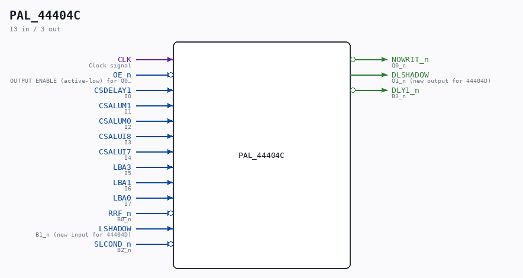

# PAL_44404C

Source: `/mnt/e/Dev/Repos/Ronny/nd-120/Verilog/PAL/PAL_44404C.v`

> Generated by `Verilog/tests/module_doc.py` from the `//!`
> comments in the source. Do not edit by hand - edit the RTL comments and regenerate.

## Description

ND120 PALASM CODE CONVERTED TO VERILOG
Component PAL 44404C
Last reviewed: 2-FEB-2025
Ronny Hansen

## Ports

| Direction | Width | Name | Description |
|---|---|---|---|
| input | `1` | `CLK` | Clock signal |
| input | `1` | `OE_n` *(active low)* | OUTPUT ENABLE (active-low) for Q0-Q3 |
| input | `1` | `CSDELAY1` | I0 |
| input | `1` | `CSALUM1` | I1 |
| input | `1` | `CSALUM0` | I2 |
| input | `1` | `CSALUI8` | I3 |
| input | `1` | `CSALUI7` | I4 |
| input | `1` | `LBA3` | I5 |
| input | `1` | `LBA1` | I6 |
| input | `1` | `LBA0` | I7 |
| output | `1` | `NOWRIT_n` *(active low)* | Q0_n |
| output | `1` | `DLSHADOW` | Q1_n (new output for 44404D) |
| input | `1` | `RRF_n` *(active low)* | B0_n |
| input | `1` | `LSHADOW` | B1_n (new input for 44404D) |
| input | `1` | `SLCOND_n` *(active low)* | B2_n |
| output | `1` | `DLY1_n` *(active low)* | B3_n |
