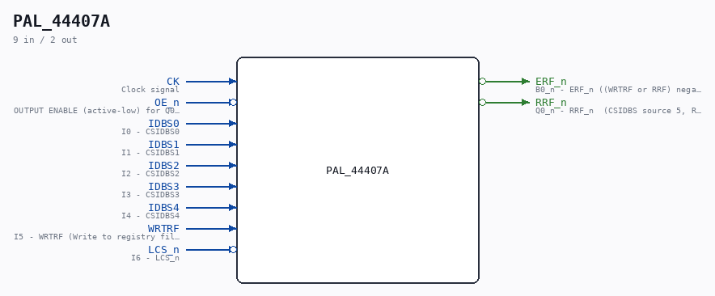

# PAL_44407A

Source: `/mnt/e/Dev/Repos/Ronny/nd-120/Verilog/PAL/PAL_44407A.v`

> Generated by `Verilog/tests/module_doc.py` from the `//!`
> comments in the source. Do not edit by hand - edit the RTL comments and regenerate.

## Description

ND120 PALASM CODE CONVERTED TO VERILOG
Component PAL 44407A
Last reviewed: 1-DEC-2024
Ronny Hansen

## Ports

| Direction | Width | Name | Description |
|---|---|---|---|
| input | `1` | `CK` | Clock signal |
| input | `1` | `OE_n` *(active low)* | OUTPUT ENABLE (active-low) for Q0-Q3 |
| input | `1` | `IDBS0` | I0 - CSIDBS0 |
| input | `1` | `IDBS1` | I1 - CSIDBS1 |
| input | `1` | `IDBS2` | I2 - CSIDBS2 |
| input | `1` | `IDBS3` | I3 - CSIDBS3 |
| input | `1` | `IDBS4` | I4 - CSIDBS4 |
| input | `1` | `WRTRF` | I5 - WRTRF (Write to registry file) |
| input | `1` | `LCS_n` *(active low)* | I6 - LCS_n |
| output | `1` | `ERF_n` *(active low)* | B0_n - ERF_n ((WRTRF or RRF) negated) - Enables RAM chips 34F and 35F in CPU_PROC_32.v for read or write of REG |
| output | `1` | `RRF_n` *(active low)* | Q0_n - RRF_n  (CSIDBS source 5, REG) |
