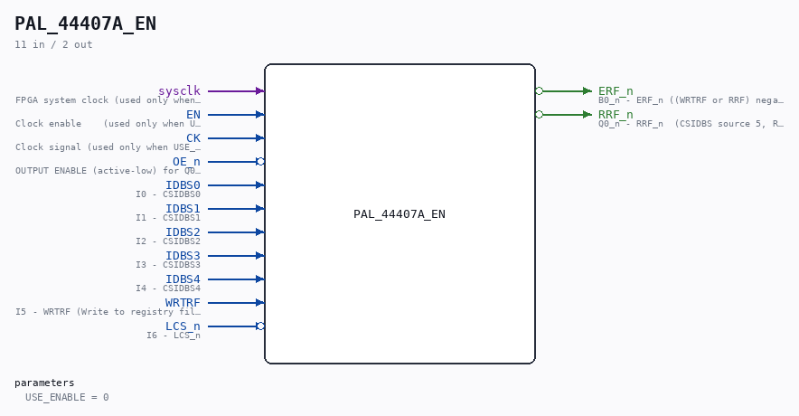

# PAL_44407A_EN

Source: `/mnt/e/Dev/Repos/Ronny/nd-120/Verilog/PAL/PAL_44407A_EN.v`

> Generated by `Verilog/tests/module_doc.py` from the `//!`
> comments in the source. Do not edit by hand - edit the RTL comments and regenerate.

## Description

ND120 PALASM CODE CONVERTED TO VERILOG
Component PAL 44407A (UERFIX) - clock-enable wrapper
USE_ENABLE=0 (default): instantiates the original PAL_44407A untouched
(posedge CK registered outputs).
USE_ENABLE=1: structural copy of PAL_44407A with the registered
equations captured on `posedge sysclk + if (EN)` (P2 clock-domain
conversion, docs/plan-fix-unconstrained-clocks.md - EN is CYC_36's
CLK_EN pulse aligned with the CLK rise). Equations are line-for-line
identical to PAL_44407A.v; only the flop trigger changes.
The original PAL_44407A.v is generated from PALASM and is never
modified - keep the equations here in sync with it.
Last reviewed: 10-JUL-2026
Ronny Hansen

## Parameters

| Parameter | Default |
|---|---|
| `USE_ENABLE` | `0` |

## Ports

| Direction | Width | Name | Description |
|---|---|---|---|
| input | `1` | `sysclk` | FPGA system clock (used only when USE_ENABLE=1) |
| input | `1` | `EN` | Clock enable    (used only when USE_ENABLE=1) |
| input | `1` | `CK` | Clock signal (used only when USE_ENABLE=0) |
| input | `1` | `OE_n` *(active low)* | OUTPUT ENABLE (active-low) for Q0-Q3 |
| input | `1` | `IDBS0` | I0 - CSIDBS0 |
| input | `1` | `IDBS1` | I1 - CSIDBS1 |
| input | `1` | `IDBS2` | I2 - CSIDBS2 |
| input | `1` | `IDBS3` | I3 - CSIDBS3 |
| input | `1` | `IDBS4` | I4 - CSIDBS4 |
| input | `1` | `WRTRF` | I5 - WRTRF (Write to registry file) |
| input | `1` | `LCS_n` *(active low)* | I6 - LCS_n |
| output | `1` | `ERF_n` *(active low)* | B0_n - ERF_n ((WRTRF or RRF) negated) - Enables RAM chips 34F and 35F in CPU_PROC_32.v for read or write of REG |
| output | `1` | `RRF_n` *(active low)* | Q0_n - RRF_n  (CSIDBS source 5, REG) |
