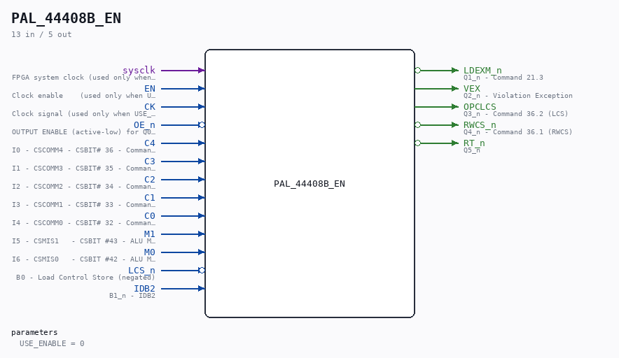

# PAL_44408B_EN

Source: `/mnt/e/Dev/Repos/Ronny/nd-120/Verilog/PAL/PAL_44408B_EN.v`

> Generated by `Verilog/tests/module_doc.py` from the `//!`
> comments in the source. Do not edit by hand - edit the RTL comments and regenerate.

## Description

ND120 PALASM CODE CONVERTED TO VERILOG
Component PAL 44408B (VEXFIX) - clock-enable wrapper
USE_ENABLE=0 (default): instantiates the original PAL_44408B untouched
(posedge CK registered outputs).
USE_ENABLE=1: structural copy of PAL_44408B with the registered
equations captured on `posedge sysclk + if (EN)` (P2 clock-domain
conversion, docs/plan-fix-unconstrained-clocks.md - EN is CYC_36's
CLK_EN pulse aligned with the CLK rise). Equations are line-for-line
identical to PAL_44408B.v; only the flop trigger changes.
The original PAL_44408B.v is generated from PALASM and is never
modified - keep the equations here in sync with it.
Last reviewed: 10-JUL-2026
Ronny Hansen

## Parameters

| Parameter | Default |
|---|---|
| `USE_ENABLE` | `0` |

## Ports

| Direction | Width | Name | Description |
|---|---|---|---|
| input | `1` | `sysclk` | FPGA system clock (used only when USE_ENABLE=1) |
| input | `1` | `EN` | Clock enable    (used only when USE_ENABLE=1) |
| input | `1` | `CK` | Clock signal (used only when USE_ENABLE=0) |
| input | `1` | `OE_n` *(active low)* | OUTPUT ENABLE (active-low) for Q0-Q3 |
| input | `1` | `C4` | I0 - CSCOMM4 - CSBIT# 36 - Command bit 4 |
| input | `1` | `C3` | I1 - CSCOMM3 - CSBIT# 35 - Command bit 3 |
| input | `1` | `C2` | I2 - CSCOMM2 - CSBIT# 34 - Command bit 2 |
| input | `1` | `C1` | I3 - CSCOMM1 - CSBIT# 33 - Command bit 1 |
| input | `1` | `C0` | I4 - CSCOMM0 - CSBIT# 32 - Command bit 0 |
| input | `1` | `M1` | I5 - CSMIS1   - CSBIT #43 - ALU MIS1 SIGNAL (also used for sub-commands for CSCOMM) |
| input | `1` | `M0` | I6 - CSMIS0   - CSBIT #42 - ALU MIS0 SIGNAL (also used for sub-commands for CSCOMM) |
| input | `1` | `LCS_n` *(active low)* | B0 - Load Control Store (negated) |
| input | `1` | `IDB2` | B1_n - IDB2 |
| output | `1` | `LDEXM_n` *(active low)* | Q1_n - Command 21.3 |
| output | `1` | `VEX` | Q2_n - Violation Exception |
| output | `1` | `OPCLCS` | Q3_n - Command 36.2 (LCS) |
| output | `1` | `RWCS_n` *(active low)* | Q4_n - Command 36.1 (RWCS) |
| output | `1` | `RT_n` *(active low)* | Q5_n |
