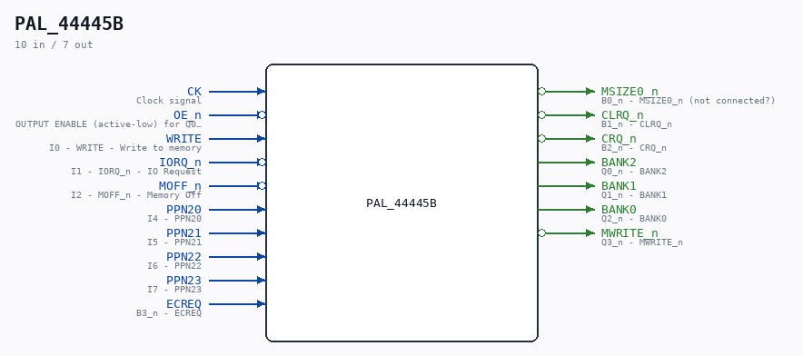

# PAL_44445B

Source: `/mnt/e/Dev/Repos/Ronny/nd-120/Verilog/PAL/PAL_44445B.v`

> Generated by `Verilog/tests/module_doc.py` from the `//!`
> comments in the source. Do not edit by hand - edit the RTL comments and regenerate.

## Description

ND120 PALASM CODE CONVERTED TO VERILOG
Component PAL 44445B
Last reviewed: 14-DEC-2024
Ronny Hansen

## Ports

| Direction | Width | Name | Description |
|---|---|---|---|
| input | `1` | `CK` | Clock signal |
| input | `1` | `OE_n` *(active low)* | OUTPUT ENABLE (active-low) for Q0-Q3 |
| input | `1` | `WRITE` | I0 - WRITE - Write to memory |
| input | `1` | `IORQ_n` *(active low)* | I1 - IORQ_n - IO Request |
| input | `1` | `MOFF_n` *(active low)* | I2 - MOFF_n - Memory Off |
| input | `1` | `PPN20` | I4 - PPN20 |
| input | `1` | `PPN21` | I5 - PPN21 |
| input | `1` | `PPN22` | I6 - PPN22 |
| input | `1` | `PPN23` | I7 - PPN23 |
| output | `1` | `MSIZE0_n` *(active low)* | B0_n - MSIZE0_n (not connected?) |
| output | `1` | `CLRQ_n` *(active low)* | B1_n - CLRQ_n |
| output | `1` | `CRQ_n` *(active low)* | B2_n - CRQ_n |
| input | `1` | `ECREQ` | B3_n - ECREQ |
| output | `1` | `BANK2` | Q0_n - BANK2 |
| output | `1` | `BANK1` | Q1_n - BANK1 |
| output | `1` | `BANK0` | Q2_n - BANK0 |
| output | `1` | `MWRITE_n` *(active low)* | Q3_n - MWRITE_n |
