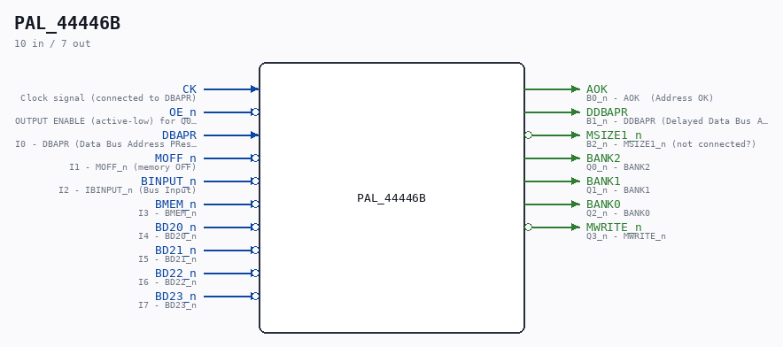

# PAL_44446B

Source: `/mnt/e/Dev/Repos/Ronny/nd-120/Verilog/PAL/PAL_44446B.v`

> Generated by `Verilog/tests/module_doc.py` from the `//!`
> comments in the source. Do not edit by hand - edit the RTL comments and regenerate.

## Description

ND120 PALASM CODE CONVERTED TO VERILOG
Component PAL 44446B
Last reviewed: 22-MAR-2025
Ronny Hansen

## Ports

| Direction | Width | Name | Description |
|---|---|---|---|
| input | `1` | `CK` | Clock signal (connected to DBAPR) |
| input | `1` | `OE_n` *(active low)* | OUTPUT ENABLE (active-low) for Q0-Q3 (connected to BGNT_n) |
| input | `1` | `DBAPR` | I0 - DBAPR (Data Bus Address PResent) |
| input | `1` | `MOFF_n` *(active low)* | I1 - MOFF_n (memory OFF) |
| input | `1` | `BINPUT_n` *(active low)* | I2 - IBINPUT_n (Bus Input) |
| input | `1` | `BMEM_n` *(active low)* | I3 - BMEM_n |
| input | `1` | `BD20_n` *(active low)* | I4 - BD20_n |
| input | `1` | `BD21_n` *(active low)* | I5 - BD21_n |
| input | `1` | `BD22_n` *(active low)* | I6 - BD22_n |
| input | `1` | `BD23_n` *(active low)* | I7 - BD23_n |
| output | `1` | `AOK` | B0_n - AOK  (Address OK) |
| output | `1` | `DDBAPR` | B1_n - DDBAPR (Delayed Data Bus Address Present) |
| output | `1` | `MSIZE1_n` *(active low)* | B2_n - MSIZE1_n (not connected?) |
| output | `1` | `BANK2` | Q0_n - BANK2 |
| output | `1` | `BANK1` | Q1_n - BANK1 |
| output | `1` | `BANK0` | Q2_n - BANK0 |
| output | `1` | `MWRITE_n` *(active low)* | Q3_n - MWRITE_n |
