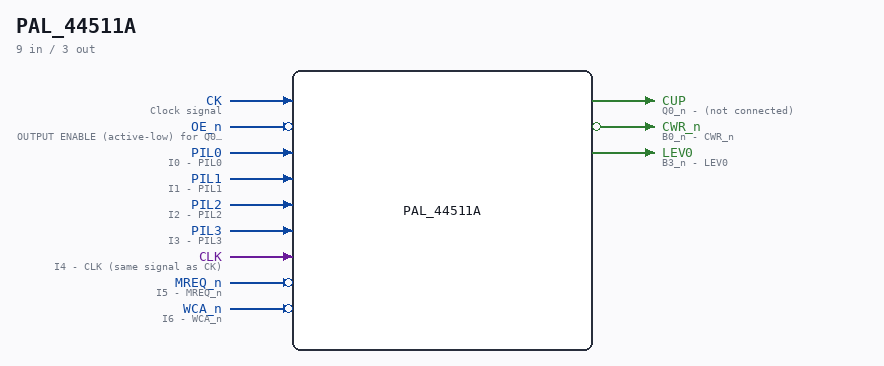

# PAL_44511A

Source: `/mnt/e/Dev/Repos/Ronny/nd-120/Verilog/PAL/PAL_44511A.v`

> Generated by `Verilog/tests/module_doc.py` from the `//!`
> comments in the source. Do not edit by hand - edit the RTL comments and regenerate.

## Description

ND120 PALASM CODE CONVERTED TO VERILOG
Component PAL 44511A
Last reviewed: 2-FEB-2025
Ronny Hansen

## Ports

| Direction | Width | Name | Description |
|---|---|---|---|
| input | `1` | `CK` | Clock signal |
| input | `1` | `OE_n` *(active low)* | OUTPUT ENABLE (active-low) for Q0-Q3 |
| input | `1` | `PIL0` | I0 - PIL0 |
| input | `1` | `PIL1` | I1 - PIL1 |
| input | `1` | `PIL2` | I2 - PIL2 |
| input | `1` | `PIL3` | I3 - PIL3 |
| input | `1` | `CLK` | I4 - CLK (same signal as CK) |
| input | `1` | `MREQ_n` *(active low)* | I5 - MREQ_n |
| input | `1` | `WCA_n` *(active low)* | I6 - WCA_n |
| output | `1` | `CUP` | Q0_n - (not connected) |
| output | `1` | `CWR_n` *(active low)* | B0_n - CWR_n |
| output | `1` | `LEV0` | B3_n - LEV0 |
