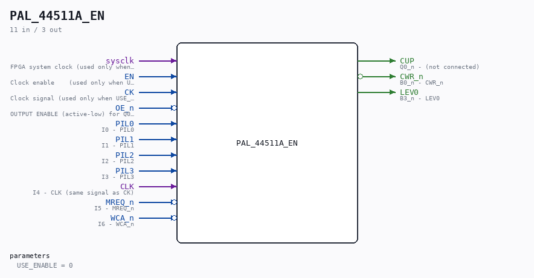

# PAL_44511A_EN

Source: `/mnt/e/Dev/Repos/Ronny/nd-120/Verilog/PAL/PAL_44511A_EN.v`

> Generated by `Verilog/tests/module_doc.py` from the `//!`
> comments in the source. Do not edit by hand - edit the RTL comments and regenerate.

## Description

ND120 PALASM CODE CONVERTED TO VERILOG
Component PAL 44511A (LEV0) - clock-enable wrapper
USE_ENABLE=0 (default): instantiates the original PAL_44511A untouched
(posedge CK registered outputs).
USE_ENABLE=1: structural copy of PAL_44511A with the registered
equations captured on `posedge sysclk + if (EN)` (P2 clock-domain
conversion, docs/plan-fix-unconstrained-clocks.md - EN is CYC_36's
CLK_EN pulse aligned with the CLK rise). Equations are line-for-line
identical to PAL_44511A.v; only the flop trigger changes.
The original PAL_44511A.v is generated from PALASM and is never
modified - keep the equations here in sync with it.
Last reviewed: 10-JUL-2026
Ronny Hansen

## Parameters

| Parameter | Default |
|---|---|
| `USE_ENABLE` | `0` |

## Ports

| Direction | Width | Name | Description |
|---|---|---|---|
| input | `1` | `sysclk` | FPGA system clock (used only when USE_ENABLE=1) |
| input | `1` | `EN` | Clock enable    (used only when USE_ENABLE=1) |
| input | `1` | `CK` | Clock signal (used only when USE_ENABLE=0) |
| input | `1` | `OE_n` *(active low)* | OUTPUT ENABLE (active-low) for Q0-Q3 |
| input | `1` | `PIL0` | I0 - PIL0 |
| input | `1` | `PIL1` | I1 - PIL1 |
| input | `1` | `PIL2` | I2 - PIL2 |
| input | `1` | `PIL3` | I3 - PIL3 |
| input | `1` | `CLK` | I4 - CLK (same signal as CK) |
| input | `1` | `MREQ_n` *(active low)* | I5 - MREQ_n |
| input | `1` | `WCA_n` *(active low)* | I6 - WCA_n |
| output | `1` | `CUP` | Q0_n - (not connected) |
| output | `1` | `CWR_n` *(active low)* | B0_n - CWR_n |
| output | `1` | `LEV0` | B3_n - LEV0 |
