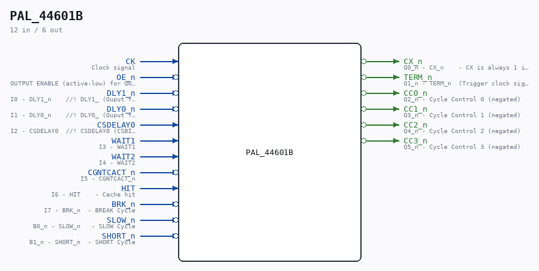

# PAL_44601B

Source: `/mnt/e/Dev/Repos/Ronny/nd-120/Verilog/PAL/PAL_44601B.v`

> Generated by `Verilog/tests/module_doc.py` from the `//!`
> comments in the source. Do not edit by hand - edit the RTL comments and regenerate.

## Description

ND120 PALASM CODE CONVERTED TO VERILOG
Component PAL 44601B
Last reviewed: 9-FEB-2025
Ronny Hansen

## Ports

| Direction | Width | Name | Description |
|---|---|---|---|
| input | `1` | `CK` | Clock signal |
| input | `1` | `OE_n` *(active low)* | OUTPUT ENABLE (active-low) for Q0-Q5 |
| input | `1` | `DLY1_n` *(active low)* | I0 - DLY1_n    //! DLY1_ (Ouput from PAL 44404 DLY1_n (B3) |
| input | `1` | `DLY0_n` *(active low)* | I1 - DLY0_n    //! DLY0_ (Ouput from PAL 44403 DLY0_n (B0) |
| input | `1` | `CSDELAY0` | I2 - CSDELAY0  //! CSDELAY0 (CSBITS #26 - DELAY 0) |
| input | `1` | `WAIT1` | I3 - WAIT1 |
| input | `1` | `WAIT2` | I4 - WAIT2 |
| input | `1` | `CGNTCACT_n` *(active low)* | I5 - CGNTCACT_n |
| input | `1` | `HIT` | I6 - HIT    - Cache hit |
| input | `1` | `BRK_n` *(active low)* | I7 - BRK_n  - BREAK Cycle |
| input | `1` | `SLOW_n` *(active low)* | B0_n - SLOW_n   - SLOW Cycle |
| input | `1` | `SHORT_n` *(active low)* | B1_n - SHORT_n  - SHORT Cycle |
| output | `1` | `CX_n` *(active low)* | Q0_n - CX_n    - CX is always 1 in the fast version (CX_n = 0) |
| output | `1` | `TERM_n` *(active low)* | Q1_n - TERM_n  (Trigger clock signal that latches CS input signals and more) |
| output | `1` | `CC0_n` *(active low)* | Q2_n - Cycle Control 0 (negated) |
| output | `1` | `CC1_n` *(active low)* | Q3_n - Cycle Control 1 (negated) |
| output | `1` | `CC2_n` *(active low)* | Q4_n - Cycle Control 2 (negated) |
| output | `1` | `CC3_n` *(active low)* | Q5_n - Cycle Control 3 (negated) |
