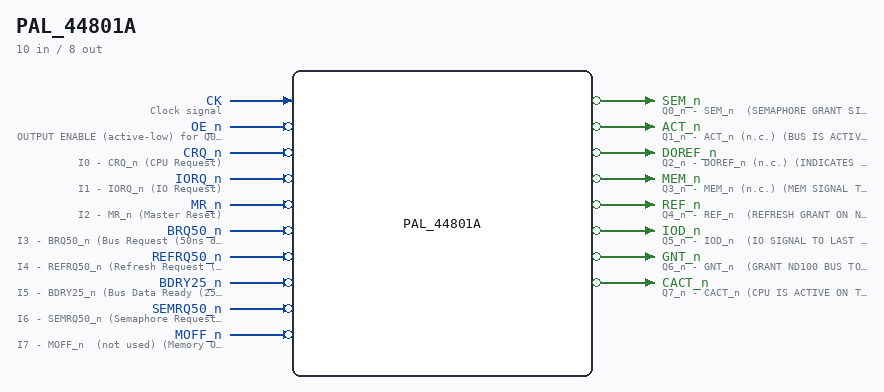

# PAL_44801A

Source: `/mnt/e/Dev/Repos/Ronny/nd-120/Verilog/PAL/PAL_44801A.v`

> Generated by `Verilog/tests/module_doc.py` from the `//!`
> comments in the source. Do not edit by hand - edit the RTL comments and regenerate.

## Description

ND120 PALASM CODE CONVERTED TO VERILOG
Component PAL 44801A
Last reviewed: 22-MAR-2025
Ronny Hansen

## Ports

| Direction | Width | Name | Description |
|---|---|---|---|
| input | `1` | `CK` | Clock signal |
| input | `1` | `OE_n` *(active low)* | OUTPUT ENABLE (active-low) for Q0-Q5 |
| input | `1` | `CRQ_n` *(active low)* | I0 - CRQ_n (CPU Request) |
| input | `1` | `IORQ_n` *(active low)* | I1 - IORQ_n (IO Request) |
| input | `1` | `MR_n` *(active low)* | I2 - MR_n (Master Reset) |
| input | `1` | `BRQ50_n` *(active low)* | I3 - BRQ50_n (Bus Request (50ns delayed)) |
| input | `1` | `REFRQ50_n` *(active low)* | I4 - REFRQ50_n (Refresh Request (50ns delayed)) |
| input | `1` | `BDRY25_n` *(active low)* | I5 - BDRY25_n (Bus Data Ready (25ns delayed)) |
| input | `1` | `SEMRQ50_n` *(active low)* | I6 - SEMRQ50_n (Semaphore Request (50ns delayed)) |
| input | `1` | `MOFF_n` *(active low)* | I7 - MOFF_n  (not used) (Memory OFF) |
| output | `1` | `SEM_n` *(active low)* | Q0_n - SEM_n  (SEMAPHORE GRANT SIGNAL) |
| output | `1` | `ACT_n` *(active low)* | Q1_n - ACT_n (n.c.) (BUS IS ACTIVE) |
| output | `1` | `DOREF_n` *(active low)* | Q2_n - DOREF_n (n.c.) (INDICATES THAT LAST BUS CYCLE WAS A REFRESH) |
| output | `1` | `MEM_n` *(active low)* | Q3_n - MEM_n (n.c.) (MEM SIGNAL TO LAST FOR ENTIRE BUS CYCLE) |
| output | `1` | `REF_n` *(active low)* | Q4_n - REF_n  (REFRESH GRANT ON ND100 BUS) |
| output | `1` | `IOD_n` *(active low)* | Q5_n - IOD_n  (IO SIGNAL TO LAST FOR THE ENTIRE BUS CYCLE) |
| output | `1` | `GNT_n` *(active low)* | Q6_n - GNT_n  (GRANT ND100 BUS TO A DMA DEVICE OR EXTERNAL BUS CONTROLLER) |
| output | `1` | `CACT_n` *(active low)* | Q7_n - CACT_n (CPU IS ACTIVE ON THE ND100 BUS) |
