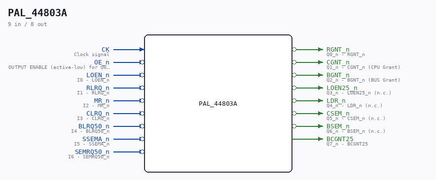

# PAL_44803A

Source: `/mnt/e/Dev/Repos/Ronny/nd-120/Verilog/PAL/PAL_44803A.v`

> Generated by `Verilog/tests/module_doc.py` from the `//!`
> comments in the source. Do not edit by hand - edit the RTL comments and regenerate.

## Description

ND120 PALASM CODE CONVERTED TO VERILOG
Component PAL 44803A
Last reviewed: 14-DEC-2024
Ronny Hansen

## Ports

| Direction | Width | Name | Description |
|---|---|---|---|
| input | `1` | `CK` | Clock signal |
| input | `1` | `OE_n` *(active low)* | OUTPUT ENABLE (active-low) for Q0-Q5 |
| input | `1` | `LOEN_n` *(active low)* | I0 - LOEN_n |
| input | `1` | `RLRQ_n` *(active low)* | I1 - RLRQ_n |
| input | `1` | `MR_n` *(active low)* | I2 - MR_n |
| input | `1` | `CLRQ_n` *(active low)* | I3 - CLRQ_n |
| input | `1` | `BLRQ50_n` *(active low)* | I4 - BLRQ50_n |
| input | `1` | `SSEMA_n` *(active low)* | I5 - SSEMA_n |
| input | `1` | `SEMRQ50_n` *(active low)* | I6 - SEMRQ50_n |
| output | `1` | `RGNT_n` *(active low)* | Q0_n - RGNT_n |
| output | `1` | `CGNT_n` *(active low)* | Q1_n - CGNT_n (CPU Grant) |
| output | `1` | `BGNT_n` *(active low)* | Q2_n - BGNT_n (BUS Grant) |
| output | `1` | `LOEN25_n` *(active low)* | Q3_n - LOEN25_n (n.c.) |
| output | `1` | `LDR_n` *(active low)* | Q4_n - LDR_n (n.c.) |
| output | `1` | `CSEM_n` *(active low)* | Q5_n - CSEM_n (n.c.) |
| output | `1` | `BSEM_n` *(active low)* | Q6_n - BSEM_n (n.c.) |
| output | `1` | `BCGNT25` | Q7_n - BCGNT25 |
