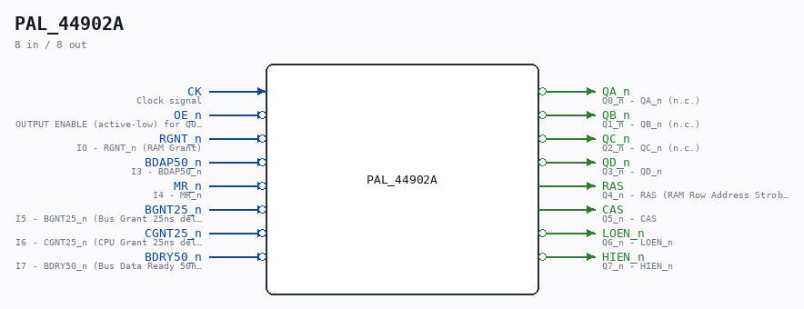

# PAL_44902A

Source: `/mnt/e/Dev/Repos/Ronny/nd-120/Verilog/PAL/PAL_44902A.v`

> Generated by `Verilog/tests/module_doc.py` from the `//!`
> comments in the source. Do not edit by hand - edit the RTL comments and regenerate.

## Description

ND120 PALASM CODE CONVERTED TO VERILOG
Component PAL 44902A
Last reviewed: 14-DEC-2024
Ronny Hansen

## Ports

| Direction | Width | Name | Description |
|---|---|---|---|
| input | `1` | `CK` | Clock signal |
| input | `1` | `OE_n` *(active low)* | OUTPUT ENABLE (active-low) for Q0-Q5 |
| input | `1` | `RGNT_n` *(active low)* | I0 - RGNT_n (RAM Grant) |
| input | `1` | `BDAP50_n` *(active low)* | I3 - BDAP50_n |
| input | `1` | `MR_n` *(active low)* | I4 - MR_n |
| input | `1` | `BGNT25_n` *(active low)* | I5 - BGNT25_n (Bus Grant 25ns delayed) |
| input | `1` | `CGNT25_n` *(active low)* | I6 - CGNT25_n (CPU Grant 25ns delayed) |
| input | `1` | `BDRY50_n` *(active low)* | I7 - BDRY50_n (Bus Data Ready 50ns delayed) |
| output | `1` | `QA_n` *(active low)* | Q0_n - QA_n (n.c.) |
| output | `1` | `QB_n` *(active low)* | Q1_n - QB_n (n.c.) |
| output | `1` | `QC_n` *(active low)* | Q2_n - QC_n (n.c.) |
| output | `1` | `QD_n` *(active low)* | Q3_n - QD_n |
| output | `1` | `RAS` | Q4_n - RAS (RAM Row Address Strobe) |
| output | `1` | `CAS` | Q5_n - CAS |
| output | `1` | `LOEN_n` *(active low)* | Q6_n - LOEN_n |
| output | `1` | `HIEN_n` *(active low)* | Q7_n - HIEN_n |
