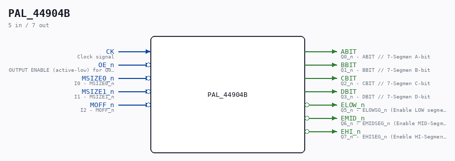

# PAL_44904B

Source: `/mnt/e/Dev/Repos/Ronny/nd-120/Verilog/PAL/PAL_44904B.v`

> Generated by `Verilog/tests/module_doc.py` from the `//!`
> comments in the source. Do not edit by hand - edit the RTL comments and regenerate.

## Description

ND120 PALASM CODE CONVERTED TO VERILOG
Component PAL 44904B
Last reviewed: 2-FEB-2025
Ronny Hansen

## Ports

| Direction | Width | Name | Description |
|---|---|---|---|
| input | `1` | `CK` | Clock signal |
| input | `1` | `OE_n` *(active low)* | OUTPUT ENABLE (active-low) for Q0-Q5 |
| input | `1` | `MSIZE0_n` *(active low)* | I0 - MSIZE0_n |
| input | `1` | `MSIZE1_n` *(active low)* | I1 - MSIZE1_n |
| input | `1` | `MOFF_n` *(active low)* | I2 - MOFF_n |
| output | `1` | `ABIT` | Q0_n - ABIT // 7-Segmen A-bit |
| output | `1` | `BBIT` | Q1_n - BBIT // 7-Segmen B-bit |
| output | `1` | `CBIT` | Q2_n - CBIT // 7-Segmen C-bit |
| output | `1` | `DBIT` | Q3_n - DBIT // 7-Segmen D-bit |
| output | `1` | `ELOW_n` *(active low)* | Q5_n - ELOWSG_n (Enable LOW segment) |
| output | `1` | `EMID_n` *(active low)* | Q6_n - EMIDSEG_n (Enable MID-Segment) |
| output | `1` | `EHI_n` *(active low)* | Q7_n - EHISEG_n (Eneble HI-Segment) |
