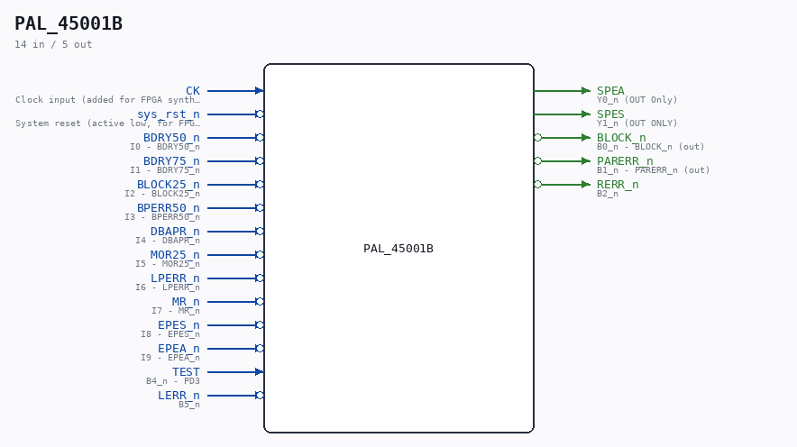

# PAL_45001B

Source: `/mnt/e/Dev/Repos/Ronny/nd-120/Verilog/PAL/PAL_45001B.v`

> Generated by `Verilog/tests/module_doc.py` from the `//!`
> comments in the source. Do not edit by hand - edit the RTL comments and regenerate.

## Description

ND120 PALASM CODE CONVERTED TO VERILOG
Component PAL 45001B
Last reviewed: 14-DEC-2024
Ronny Hansen

## Ports

| Direction | Width | Name | Description |
|---|---|---|---|
| input | `1` | `CK` | Clock input (added for FPGA synthesis) |
| input | `1` | `sys_rst_n` *(active low)* | System reset (active low, for FPGA synthesis) |
| input | `1` | `BDRY50_n` *(active low)* | I0 - BDRY50_n |
| input | `1` | `BDRY75_n` *(active low)* | I1 - BDRY75_n |
| input | `1` | `BLOCK25_n` *(active low)* | I2 - BLOCK25_n |
| input | `1` | `BPERR50_n` *(active low)* | I3 - BPERR50_n |
| input | `1` | `DBAPR_n` *(active low)* | I4 - DBAPR_n |
| input | `1` | `MOR25_n` *(active low)* | I5 - MOR25_n |
| input | `1` | `LPERR_n` *(active low)* | I6 - LPERR_n |
| input | `1` | `MR_n` *(active low)* | I7 - MR_n |
| input | `1` | `EPES_n` *(active low)* | I8 - EPES_n |
| input | `1` | `EPEA_n` *(active low)* | I9 - EPEA_n |
| output | `1` | `SPEA` | Y0_n (OUT Only) |
| output | `1` | `SPES` | Y1_n (OUT ONLY) |
| output | `1` | `BLOCK_n` *(active low)* | B0_n - BLOCK_n (out) |
| output | `1` | `PARERR_n` *(active low)* | B1_n - PARERR_n (out) |
| output | `1` | `RERR_n` *(active low)* | B2_n |
| input | `1` | `TEST` | B4_n - PD3 |
| input | `1` | `LERR_n` *(active low)* | B5_n |
