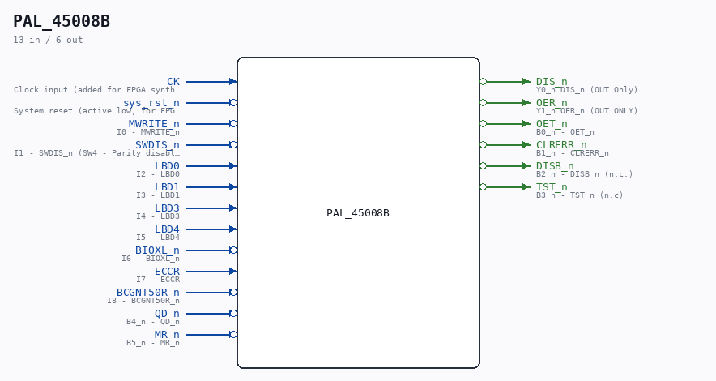

# PAL_45008B

Source: `/mnt/e/Dev/Repos/Ronny/nd-120/Verilog/PAL/PAL_45008B.v`

> Generated by `Verilog/tests/module_doc.py` from the `//!`
> comments in the source. Do not edit by hand - edit the RTL comments and regenerate.

## Description

ND120 PALASM CODE CONVERTED TO VERILOG
Component PAL 45008B
Last reviewed: 22-MAR-2025
Ronny Hansen

## Ports

| Direction | Width | Name | Description |
|---|---|---|---|
| input | `1` | `CK` | Clock input (added for FPGA synthesis) |
| input | `1` | `sys_rst_n` *(active low)* | System reset (active low, for FPGA synthesis) |
| input | `1` | `MWRITE_n` *(active low)* | I0 - MWRITE_n |
| input | `1` | `SWDIS_n` *(active low)* | I1 - SWDIS_n (SW4 - Parity disable, normal position = down.) |
| input | `1` | `LBD0` | I2 - LBD0 |
| input | `1` | `LBD1` | I3 - LBD1 |
| input | `1` | `LBD3` | I4 - LBD3 |
| input | `1` | `LBD4` | I5 - LBD4 |
| input | `1` | `BIOXL_n` *(active low)* | I6 - BIOXL_n |
| input | `1` | `ECCR` | I7 - ECCR |
| input | `1` | `BCGNT50R_n` *(active low)* | I8 - BCGNT50R_n |
| output | `1` | `DIS_n` *(active low)* | Y0_n DIS_n (OUT Only) |
| output | `1` | `OER_n` *(active low)* | Y1_n OER_n (OUT ONLY) |
| output | `1` | `OET_n` *(active low)* | B0_n - OET_n |
| output | `1` | `CLRERR_n` *(active low)* | B1_n - CLRERR_n |
| output | `1` | `DISB_n` *(active low)* | B2_n - DISB_n (n.c.) |
| output | `1` | `TST_n` *(active low)* | B3_n - TST_n (n.c) |
| input | `1` | `QD_n` *(active low)* | B4_n - QD_n |
| input | `1` | `MR_n` *(active low)* | B5_n - MR_n |
