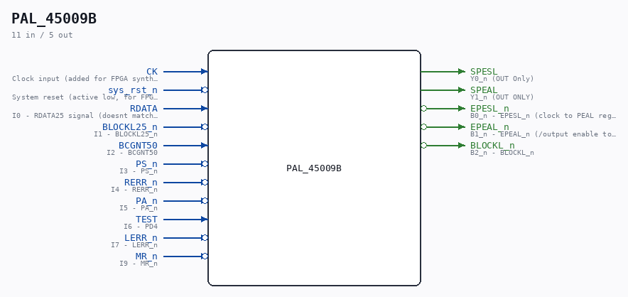

# PAL_45009B

Source: `/mnt/e/Dev/Repos/Ronny/nd-120/Verilog/PAL/PAL_45009B.v`

> Generated by `Verilog/tests/module_doc.py` from the `//!`
> comments in the source. Do not edit by hand - edit the RTL comments and regenerate.

## Description

ND120 PALASM CODE CONVERTED TO VERILOG
Component PAL 45009B
Last reviewed: 2-FEB-2025
Ronny Hansen

## Ports

| Direction | Width | Name | Description |
|---|---|---|---|
| input | `1` | `CK` | Clock input (added for FPGA synthesis) |
| input | `1` | `sys_rst_n` *(active low)* | System reset (active low, for FPGA synthesis) |
| input | `1` | `RDATA` | I0 - RDATA25 signal (doesnt match name) |
| input | `1` | `BLOCKL25_n` *(active low)* | I1 - BLOCKL25_n |
| input | `1` | `BCGNT50` | I2 - BCGNT50 |
| input | `1` | `PS_n` *(active low)* | I3 - PS_n |
| input | `1` | `RERR_n` *(active low)* | I4 - RERR_n |
| input | `1` | `PA_n` *(active low)* | I5 - PA_n |
| input | `1` | `TEST` | I6 - PD4 |
| input | `1` | `LERR_n` *(active low)* | I7 - LERR_n |
| input | `1` | `MR_n` *(active low)* | I9 - MR_n |
| output | `1` | `SPESL` | Y0_n (OUT Only) |
| output | `1` | `SPEAL` | Y1_n (OUT ONLY) |
| output | `1` | `EPESL_n` *(active low)* | B0_n - EPESL_n (clock to PEAL register) |
| output | `1` | `EPEAL_n` *(active low)* | B1_n - EPEAL_n (/output enable to PEAL register) |
| output | `1` | `BLOCKL_n` *(active low)* | B2_n - BLOCKL_n |
