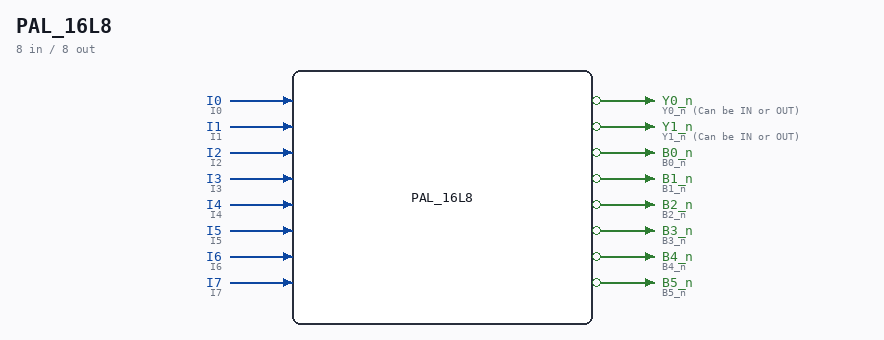

# PAL_16L8

Source: `/mnt/e/Dev/Repos/Ronny/nd-120/Verilog/PAL/template/PAL18L8.v`

> Generated by `Verilog/tests/module_doc.py` from the `//!`
> comments in the source. Do not edit by hand - edit the RTL comments and regenerate.

## Ports

| Direction | Width | Name | Description |
|---|---|---|---|
| input | `1` | `I0` | I0 |
| input | `1` | `I1` | I1 |
| input | `1` | `I2` | I2 |
| input | `1` | `I3` | I3 |
| input | `1` | `I4` | I4 |
| input | `1` | `I5` | I5 |
| input | `1` | `I6` | I6 |
| input | `1` | `I7` | I7 |
| output | `1` | `Y0_n` *(active low)* | Y0_n (Can be IN or OUT) |
| output | `1` | `Y1_n` *(active low)* | Y1_n (Can be IN or OUT) |
| output | `1` | `B0_n` *(active low)* | B0_n |
| output | `1` | `B1_n` *(active low)* | B1_n |
| output | `1` | `B2_n` *(active low)* | B2_n |
| output | `1` | `B3_n` *(active low)* | B3_n |
| output | `1` | `B4_n` *(active low)* | B4_n |
| output | `1` | `B5_n` *(active low)* | B5_n |
