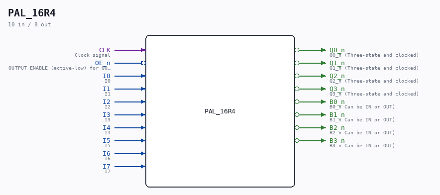

# PAL_16R4

Source: `/mnt/e/Dev/Repos/Ronny/nd-120/Verilog/PAL/template/PAL16R4.v`

> Generated by `Verilog/tests/module_doc.py` from the `//!`
> comments in the source. Do not edit by hand - edit the RTL comments and regenerate.

## Ports

| Direction | Width | Name | Description |
|---|---|---|---|
| input | `1` | `CLK` | Clock signal |
| input | `1` | `OE_n` *(active low)* | OUTPUT ENABLE (active-low) for Q0-Q3 |
| input | `1` | `I0` | I0 |
| input | `1` | `I1` | I1 |
| input | `1` | `I2` | I2 |
| input | `1` | `I3` | I3 |
| input | `1` | `I4` | I4 |
| input | `1` | `I5` | I5 |
| input | `1` | `I6` | I6 |
| input | `1` | `I7` | I7 |
| output | `1` | `Q0_n` *(active low)* | Q0_n (Three-state and clocked) |
| output | `1` | `Q1_n` *(active low)* | Q1_n (Three-state and clocked) |
| output | `1` | `Q2_n` *(active low)* | Q2_n (Three-state and clocked) |
| output | `1` | `Q3_n` *(active low)* | Q3_n (Three-state and clocked) |
| output | `1` | `B0_n` *(active low)* | B0_n Can be IN or OUT) |
| output | `1` | `B1_n` *(active low)* | B1_n Can be IN or OUT) |
| output | `1` | `B2_n` *(active low)* | B2_n Can be IN or OUT) |
| output | `1` | `B3_n` *(active low)* | B3_n Can be IN or OUT) |
