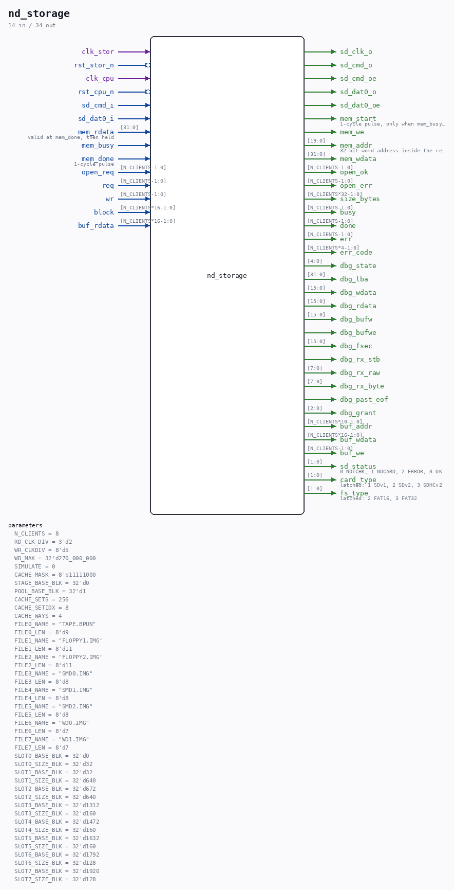

# nd_storage

Source: `/mnt/e/Dev/Repos/Ronny/nd-120/Verilog/SD-FAT/circuit/nd_storage.v`

> Generated by `Verilog/tests/module_doc.py` from the `//!`
> comments in the source. Do not edit by hand - edit the RTL comments and regenerate.

## Description

nd_storage - multi-client storage facade (top level)
THE one instance that owns the SD card and the SDRAM device region
and serves N_CLIENTS client ports, each bound to one fixed root file
on the FAT card (spec: docs/nd-storage-interface-spec.md; design:
docs/nd-storage-design.md sections 2.1 and 5.1). Feature flag:
SDFAT_STORAGE in sd_fat_features.vh (needs SDFAT_WRITE).
Owns, exactly like the proven sd_fat_test_top arrangement:
- sd_file_reader: held in reset except while a mount runs (rstn =
rst & mount's rd_run) - every open is a full card re-init, the
proven rewind/card-swap recovery. target_name/target_len are
muxed from the FILEn_NAME/LEN parameters by the granted client.
- sd_writer: always alive; the engine's write-through path drives
its single-sector CMD24 interface (burst_len=0, rca=0 - the burst
interface is a later step). Under SDFAT_STORAGE_CHECK the mount-
time contiguity checker (nd_storage_fatchk.v) owns the writer's
command pins (start/sector, rd_mode=1) while chk_busy - the mount
FSM guarantees the engine and the checker never contend: the
check runs inside the mount's exclusive card phase (after M_PARK
set phase_write=1) while the engine is parked in E_OPEN.
- SD pin mux by phase_write (mount FSM owned): reader owns the pins
while a mount runs, the writer otherwise. Only _i/_o/_oe ports -
the single tristate lives at the board top (repo rule).
- mem port mux: the mount FSM owns the device port while mnt_busy
(the engine is parked in E_OPEN then); the engine otherwise.
Client map (04-AUG-2026): 0 = TAPE.BPUN (tape-400), 1/2 = FLOPPY1/2.
IMG, 3..5 = SMD0..2.IMG, 6/7 = WD0/WD1.IMG (the ST506/8-inch
Winchester, ND_WINCHESTER.v). Winchester images are WDn.IMG, NEVER
SMDn.IMG. SMD3 was dropped to make room: the grant index is THREE bits
so 8 clients is the ceiling.
PHASE 4 - NOTHING IS PRELOADED. The 4 MB region used to hold a COPY of
each image, which meant an image could never be larger than its slot
and the mount refused anything bigger (256 KB for a Winchester, versus
a real 75 MB disc). The region is now a CACHE:
- CACHE_MASK[c]=1: client c goes through the shared tag directory
(nd_storage_cache.v). Image size is bounded only by the 16-bit
block count (128 MB), never by the region.
- CACHE_MASK[c]=0: DIRECT. One shared staging line at STAGE_BASE_BLK
- safe because the arbiter serves one client at a time - and every
block request is fetched from the card. Tape and floppy are DIRECT:
the card is quick enough and caching them would only spend region.
A mount establishes GEOMETRY ONLY (size, first sector, cluster facts):
sd_file_reader is run with no_stream=1, so it stops at the directory
match. That also ends the run at a clean card boundary - parking the
reader mid-transfer leaves the card streaming and the next card user
fails.
Status outputs: sd_status 0=NOTCHK 1=NOCARD 2=ERROR 3=OK (updated at
every mount end, degraded to ERROR by an engine watchdog or a card
write error; a later successful open restores OK). card_type/fs_type
are LATCHED from the reader while it runs (the reader's own copies
reset when the mount FSM parks it).
Last reviewed: 11-JUL-2026
Ronny Hansen

## Parameters

| Parameter | Default |
|---|---|
| `N_CLIENTS` | `8` |
| `RD_CLK_DIV` | `3'd2` |
| `WR_CLKDIV` | `8'd5` |
| `WD_MAX` | `32'd270_000_000` |
| `SIMULATE` | `0` |
| `CACHE_MASK` | `8'b11111000` |
| `STAGE_BASE_BLK` | `32'd0` |
| `POOL_BASE_BLK` | `32'd1` |
| `CACHE_SETS` | `256` |
| `CACHE_SETIDX` | `8` |
| `CACHE_WAYS` | `4` |
| `FILE0_NAME` | `"TAPE.BPUN"` |
| `FILE0_LEN` | `8'd9` |
| `FILE1_NAME` | `"FLOPPY1.IMG"` |
| `FILE1_LEN` | `8'd11` |
| `FILE2_NAME` | `"FLOPPY2.IMG"` |
| `FILE2_LEN` | `8'd11` |
| `FILE3_NAME` | `"SMD0.IMG"` |
| `FILE3_LEN` | `8'd8` |
| `FILE4_NAME` | `"SMD1.IMG"` |
| `FILE4_LEN` | `8'd8` |
| `FILE5_NAME` | `"SMD2.IMG"` |
| `FILE5_LEN` | `8'd8` |
| `FILE6_NAME` | `"WD0.IMG"` |
| `FILE6_LEN` | `8'd7` |
| `FILE7_NAME` | `"WD1.IMG"` |
| `FILE7_LEN` | `8'd7` |
| `SLOT0_BASE_BLK` | `32'd0` |
| `SLOT0_SIZE_BLK` | `32'd32` |
| `SLOT1_BASE_BLK` | `32'd32` |
| `SLOT1_SIZE_BLK` | `32'd640` |
| `SLOT2_BASE_BLK` | `32'd672` |
| `SLOT2_SIZE_BLK` | `32'd640` |
| `SLOT3_BASE_BLK` | `32'd1312` |
| `SLOT3_SIZE_BLK` | `32'd160` |
| `SLOT4_BASE_BLK` | `32'd1472` |
| `SLOT4_SIZE_BLK` | `32'd160` |
| `SLOT5_BASE_BLK` | `32'd1632` |
| `SLOT5_SIZE_BLK` | `32'd160` |
| `SLOT6_BASE_BLK` | `32'd1792` |
| `SLOT6_SIZE_BLK` | `32'd128` |
| `SLOT7_BASE_BLK` | `32'd1920` |
| `SLOT7_SIZE_BLK` | `32'd128` |

## Ports

| Direction | Width | Name | Description |
|---|---|---|---|
| input | `1` | `clk_stor` |  |
| input | `1` | `rst_stor_n` *(active low)* |  |
| input | `1` | `clk_cpu` |  |
| input | `1` | `rst_cpu_n` *(active low)* |  |
| output | `1` | `sd_clk_o` |  |
| input | `1` | `sd_cmd_i` |  |
| output | `1` | `sd_cmd_o` |  |
| output | `1` | `sd_cmd_oe` |  |
| input | `1` | `sd_dat0_i` |  |
| output | `1` | `sd_dat0_o` |  |
| output | `1` | `sd_dat0_oe` |  |
| output | `1` | `mem_start` | 1-cycle pulse, only when mem_busy=0 |
| output | `1` | `mem_we` |  |
| output | `[19:0]` | `mem_addr` | 32-bit-word address inside the region |
| output | `[31:0]` | `mem_wdata` |  |
| input | `[31:0]` | `mem_rdata` | valid at mem_done, then held |
| input | `1` | `mem_busy` |  |
| input | `1` | `mem_done` | 1-cycle pulse |
| input | `[N_CLIENTS-1:0]` | `open_req` |  |
| output | `[N_CLIENTS-1:0]` | `open_ok` |  |
| output | `[N_CLIENTS-1:0]` | `open_err` |  |
| output | `[N_CLIENTS*32-1:0]` | `size_bytes` |  |
| input | `[N_CLIENTS-1:0]` | `req` |  |
| input | `[N_CLIENTS-1:0]` | `wr` |  |
| input | `[N_CLIENTS*16-1:0]` | `block` |  |
| output | `[N_CLIENTS-1:0]` | `busy` |  |
| output | `[N_CLIENTS-1:0]` | `done` |  |
| output | `[N_CLIENTS-1:0]` | `err` |  |
| output | `[N_CLIENTS*4-1:0]` | `err_code` |  |
| output | `[4:0]` | `dbg_state` |  |
| output | `[31:0]` | `dbg_lba` |  |
| output | `[15:0]` | `dbg_wdata` |  |
| output | `[15:0]` | `dbg_rdata` |  |
| output | `[15:0]` | `dbg_bufw` |  |
| output | `1` | `dbg_bufwe` |  |
| output | `[15:0]` | `dbg_fsec` |  |
| output | `1` | `dbg_rx_stb` |  |
| output | `[7:0]` | `dbg_rx_raw` |  |
| output | `[7:0]` | `dbg_rx_byte` |  |
| output | `1` | `dbg_past_eof` |  |
| output | `[2:0]` | `dbg_grant` |  |
| output | `[N_CLIENTS*10-1:0]` | `buf_addr` |  |
| output | `[N_CLIENTS*16-1:0]` | `buf_wdata` |  |
| output | `[N_CLIENTS-1:0]` | `buf_we` |  |
| input | `[N_CLIENTS*16-1:0]` | `buf_rdata` |  |
| output | `[1:0]` | `sd_status` | 0 NOTCHK, 1 NOCARD, 2 ERROR, 3 OK |
| output | `[1:0]` | `card_type` | latched: 1 SDv1, 2 SDv2, 3 SDHCv2 |
| output | `[1:0]` | `fs_type` | latched: 2 FAT16, 3 FAT32 |
