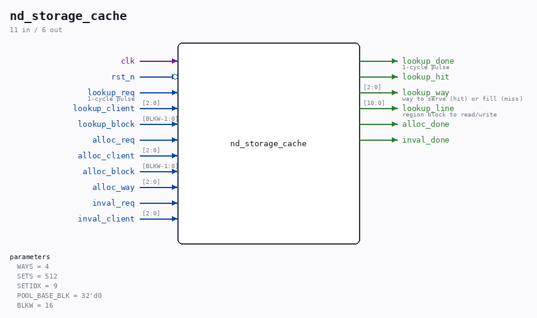

# nd_storage_cache

Source: `/mnt/e/Dev/Repos/Ronny/nd-120/Verilog/SD-FAT/circuit/nd_storage_cache.v`

> Generated by `Verilog/tests/module_doc.py` from the `//!`
> comments in the source. Do not edit by hand - edit the RTL comments and regenerate.

## Description

nd_storage_cache - tag / LRU directory for the shared block cache
Phase 4 of the storage facade. docs/nd-storage-design.md section 2.1
named "the Phase-4 tag-based cache" but never specified it; this module
and the engine changes that use it ARE that specification.
WHY
v1 mapped a client block straight onto a region block in one line
(nd_storage_engine.v: s_blk_abs <= slot_base + op_block), so an image
could never exceed its slot and the mount refused size > slot. A real
Winchester image is 75 MB against a 256 KB slot. The region is 2048
blocks = 4 MB and cannot be widened cheaply (s_blk_abs is [10:0] and
feeds mem_addr into ND120_CORE / ND3202D / MEM_43), so the region
stops being a COPY of the image and becomes a CACHE of it: every
block of an arbitrarily large image is reachable and the resident set
is whatever the guest is actually touching.
WHAT IS CACHED
Per client, via CACHE_MASK in nd_storage: 1 = through this directory,
0 = DIRECT (block requests go straight to the card, region untouched).
Tape and floppy are DIRECT - the card is quick enough for them, and
caching them would spend region on devices that do not need it. The
disc classes (SMD, Winchester) are CACHED because SINTRAN's working
set is what decides whether the machine feels quick. Enabling the
floppy later is one bit in CACHE_MASK and nothing else.
ORGANISATION
ONE SHARED pool over all cached clients, not a fixed window per unit:
the tag carries the client id, so the disc doing the work gets the
whole pool and an idle second unit costs nothing.
line         = one 2048-byte region block (the block granularity
the whole stack already uses)
set index    = client_block[SETIDX-1:0]
tag          = { client[2:0], client_block[BLKW-1:SETIDX] }
region block = POOL_BASE_BLK + set*WAYS + way
STORAGE SHAPE - the thing that decides whether this fits the FPGA
ONE array. A set's tags AND ranks AND valid bits live in a single
word, so a set is one registered read, all ways compare in the same
cycle, and the whole directory is a single-clock BSRAM with one write
port. Two rules that are not optional:
- NEVER reset the array with a loop over its entries. That infers
flip-flops instead of block RAM; at 512 sets it cost ~26k flip-
flops in the first version of this module, more than the part
has. The mass clear is a WALKING clear instead (SETS cycles after
reset), invisible because the first open spends hundreds of
thousands of cycles in SD card init before any lookup arrives.
- NEVER split rank or valid into their own arrays read
combinationally. The second version did exactly that, because the
valid bits need a mass clear, and it measured 187283 AND gates at
512x4 under yosys/synth_gowin - tens of thousands of LUT4 on a
part with 20736, nearly all of it the SETS-deep read multiplexer
and write decoder that an indexed FF array builds per bit. Folded
into the BSRAM word there is no multiplexer at all.
ONE OUTSTANDING LOOKUP
The engine serializes: one granted client, one block op at a time. So
there is no pipeline hazard here and no bypass network - IDLE -> RD
-> CMP and back. A lookup costs 3 cycles, which is noise against the
four-sector card read a miss then performs.
LRU
2 bits of rank per way per set: 0 = most recently used, WAYS-1 =
least. A hit or a fill promotes its way to 0 and pushes every way
that outranked it down one. The victim is the way at rank WAYS-1.
Invalid ways are taken before any valid way, so a cold pool fills
before it evicts anything. Ranks are read-modify-written in CMP.
WRITE POLICY
Write-through, write-allocate. The engine commits to the card FIRST,
then the region copy, then reports done - the existing ordering rule,
so a failed CMD24 never leaves the region holding data the card does
not have. No dirty bit and no writeback exists here, which is what
makes a reset or a card pull safe at any instant.
INVALIDATION
inval_req drops every line of one client - used when a client is
re-opened (card swap, remount) so lines from the old file cannot
survive into the new one. Walks the sets, two cycles each, and only
ever runs at open.
Ronny Hansen

## Parameters

| Parameter | Default |
|---|---|
| `WAYS` | `4` |
| `SETS` | `512` |
| `SETIDX` | `9` |
| `POOL_BASE_BLK` | `32'd0` |
| `BLKW` | `16` |

## Ports

| Direction | Width | Name | Description |
|---|---|---|---|
| input | `1` | `clk` |  |
| input | `1` | `rst_n` *(active low)* |  |
| input | `1` | `lookup_req` | 1-cycle pulse |
| input | `[2:0]` | `lookup_client` |  |
| input | `[BLKW-1:0]` | `lookup_block` |  |
| output | `1` | `lookup_done` | 1-cycle pulse |
| output | `1` | `lookup_hit` |  |
| output | `[2:0]` | `lookup_way` | way to serve (hit) or fill (miss) |
| output | `[10:0]` | `lookup_line` | region block to read/write |
| input | `1` | `alloc_req` |  |
| input | `[2:0]` | `alloc_client` |  |
| input | `[BLKW-1:0]` | `alloc_block` |  |
| input | `[2:0]` | `alloc_way` |  |
| output | `1` | `alloc_done` |  |
| input | `1` | `inval_req` |  |
| input | `[2:0]` | `inval_client` |  |
| output | `1` | `inval_done` |  |
