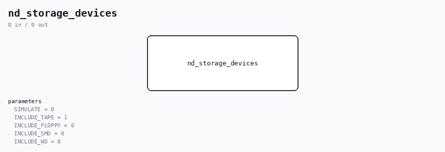

# nd_storage_devices

Source: `/mnt/e/Dev/Repos/Ronny/nd-120/Verilog/SD-FAT/circuit/nd_storage_devices.v`

> Generated by `Verilog/tests/module_doc.py` from the `//!`
> comments in the source. Do not edit by hand - edit the RTL comments and regenerate.

## Description

nd_storage_devices - board-agnostic BOOT.BPUN byte source for the
ND_TAPE_400 paper-tape device, backed by the SD-FAT storage stack.
Packages, in one reusable block for BOTH the Verilator sim and the
Tang hardware top:
nd_storage             (SD-FAT mount + reader + engine; client 0 =
BOOT.BPUN, preloaded into the SDRAM region)
nd_storage_tape_adapter(serves that file to ND_TAPE_400's byte source
port, big-endian, read-only)
a mount->open sequencer(pulses the adapter's open_start ONCE after
the mount reports OK)
The instantiating top supplies the physical backends:
- SD pads  (sim: sd_card_model.v with IMAGE=nd_boot_card.img;
Tang: the real SD card)
- SDRAM device port mem_* (sim: nds_mem_model.v; Tang: the SDRAM
bridge, same contract as nds_mem_model.v / MEM_RAM_49_SDRAM.v)
- the byte source port wires straight to ND_TAPE_400 (byte_req /
byte_valid / byte_data / source_rewind, pin-for-pin).
Two clocks (as nd_storage requires): clk_stor (SD/SDRAM domain) and
clk_cpu (the ND-120 bus/client domain). sd_status is 2-FF synchronized
into clk_cpu before it gates the one-shot open.
Only client 0 is used; clients 1-7 are tied idle. Tape is DIRECT (not
in CACHE_MASK): the card is quick enough and nothing is preloaded.
only BOOT.BPUN is preloaded (the boot card carries no other files).
Ronny Hansen

## Parameters

| Parameter | Default |
|---|---|
| `SIMULATE` | `0` |
| `INCLUDE_TAPE` | `1` |
| `INCLUDE_FLOPPY` | `0` |
| `INCLUDE_SMD` | `0` |
| `INCLUDE_WD` | `0` |
