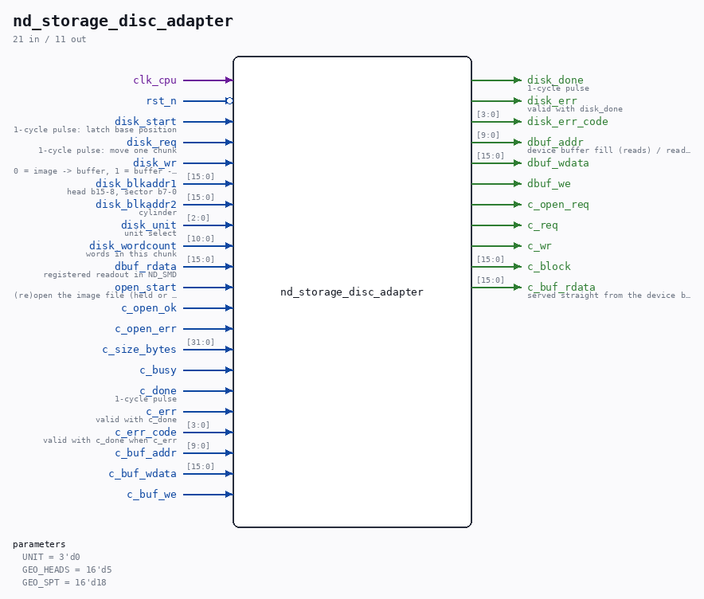

# nd_storage_disc_adapter

Source: `/mnt/e/Dev/Repos/Ronny/nd-120/Verilog/SD-FAT/circuit/nd_storage_disc_adapter.v`

> Generated by `Verilog/tests/module_doc.py` from the `//!`
> comments in the source. Do not edit by hand - edit the RTL comments and regenerate.

## Parameters

| Parameter | Default |
|---|---|
| `UNIT` | `3'd0` |
| `GEO_HEADS` | `16'd5` |
| `GEO_SPT` | `16'd18` |

## Ports

| Direction | Width | Name | Description |
|---|---|---|---|
| input | `1` | `clk_cpu` |  |
| input | `1` | `rst_n` *(active low)* |  |
| input | `1` | `disk_start` | 1-cycle pulse: latch base position |
| input | `1` | `disk_req` | 1-cycle pulse: move one chunk |
| input | `1` | `disk_wr` | 0 = image -> buffer, 1 = buffer -> image |
| input | `[15:0]` | `disk_blkaddr1` | head b15-8, sector b7-0 |
| input | `[15:0]` | `disk_blkaddr2` | cylinder |
| input | `[2:0]` | `disk_unit` | unit select |
| input | `[10:0]` | `disk_wordcount` | words in this chunk |
| output | `1` | `disk_done` | 1-cycle pulse |
| output | `1` | `disk_err` | valid with disk_done |
| output | `[3:0]` | `disk_err_code` |  |
| output | `[9:0]` | `dbuf_addr` | device buffer fill (reads) / readout (writes) |
| output | `[15:0]` | `dbuf_wdata` |  |
| output | `1` | `dbuf_we` |  |
| input | `[15:0]` | `dbuf_rdata` | registered readout in ND_SMD |
| input | `1` | `open_start` | (re)open the image file (held or pulsed) |
| output | `1` | `c_open_req` |  |
| input | `1` | `c_open_ok` |  |
| input | `1` | `c_open_err` |  |
| input | `[31:0]` | `c_size_bytes` |  |
| output | `1` | `c_req` |  |
| output | `1` | `c_wr` |  |
| output | `[15:0]` | `c_block` |  |
| input | `1` | `c_busy` |  |
| input | `1` | `c_done` | 1-cycle pulse |
| input | `1` | `c_err` | valid with c_done |
| input | `[3:0]` | `c_err_code` | valid with c_done when c_err |
| input | `[9:0]` | `c_buf_addr` |  |
| input | `[15:0]` | `c_buf_wdata` |  |
| input | `1` | `c_buf_we` |  |
| output | `[15:0]` | `c_buf_rdata` | served straight from the device buffer |
