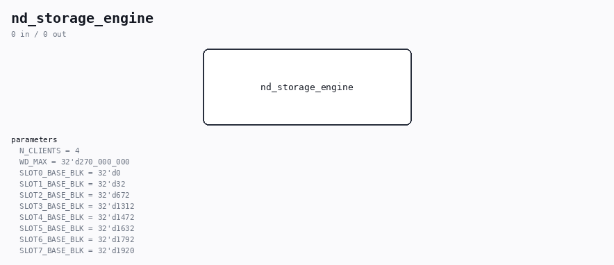

# nd_storage_engine

Source: `/mnt/e/Dev/Repos/Ronny/nd-120/Verilog/SD-FAT/circuit/nd_storage_engine.v`

> Generated by `Verilog/tests/module_doc.py` from the `//!`
> comments in the source. Do not edit by hand - edit the RTL comments and regenerate.

## Parameters

| Parameter | Default |
|---|---|
| `N_CLIENTS` | `4` |
| `WD_MAX` | `32'd270_000_000` |
| `SLOT0_BASE_BLK` | `32'd0` |
| `SLOT1_BASE_BLK` | `32'd32` |
| `SLOT2_BASE_BLK` | `32'd672` |
| `SLOT3_BASE_BLK` | `32'd1312` |
| `SLOT4_BASE_BLK` | `32'd1472` |
| `SLOT5_BASE_BLK` | `32'd1632` |
| `SLOT6_BASE_BLK` | `32'd1792` |
| `SLOT7_BASE_BLK` | `32'd1920` |
