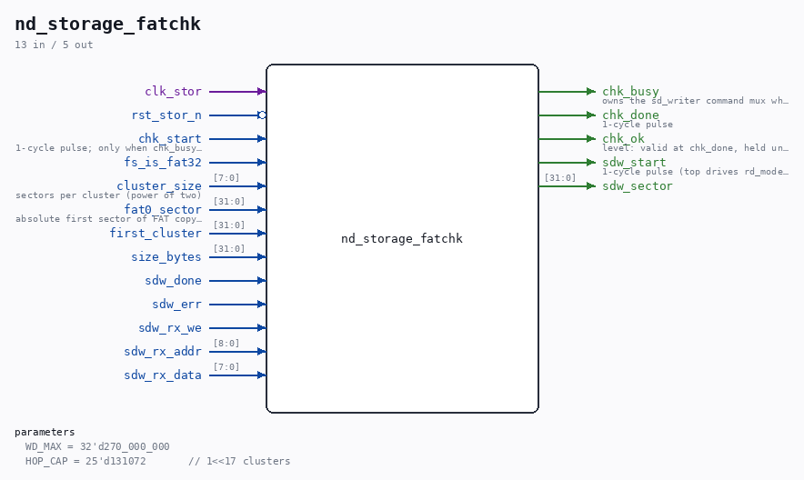

# nd_storage_fatchk

Source: `/mnt/e/Dev/Repos/Ronny/nd-120/Verilog/SD-FAT/circuit/nd_storage_fatchk.v`

> Generated by `Verilog/tests/module_doc.py` from the `//!`
> comments in the source. Do not edit by hand - edit the RTL comments and regenerate.

## Description

nd_storage mount-time contiguity checker (fatchk)
Design: docs/nd-storage-design.md section 2.4; binding contract:
docs/nd-storage-interface-spec.md sections 6 and 8 (contiguous files
are REQUIRED in v1, enforced at open). Feature flag:
SDFAT_STORAGE_CHECK in sd_fat_features.vh.
Invoked by the mount FSM (nd_storage_mount.v M_CHK) after M_PARK, i.e.
the reader is parked and phase_write=1: sd_writer owns the SD pins and
this module owns sd_writer's command interface while chk_busy (the
top's writer-command mux). For
n = ceil(size_bytes / (cluster_size * 512))
clusters starting at first_cluster the FAT must read
FAT[first_cluster + i] == first_cluster + i + 1     for i < n-1
FAT[first_cluster + n - 1] is a proper end-of-chain mark
FAT16 entries are 2-byte little-endian, EOC = masked 16-bit value
>= 0xFFF7; FAT32 entries are 4-byte little-endian, only bits [27:0]
are the cluster number, EOC = masked value >= 0x0FFFFFF7 (the
fat_sec/fat_off/is_eoc shapes of the proven sd_fat_check.v). Unlike
sd_fat_check this module does NOT follow chain pointers - it verifies
the expected value at every position - so a corrupted FAT can never
send it walking; the only guards needed are the up-front cluster-count
cap and the per-state watchdog. Verdict is a machine level: chk_ok
valid at the chk_done pulse (and held until the next run), no text.
FAT sectors are read via sd_writer read mode (CMD17, rx byte stream
into an internal 512-byte buffer with the 1-clk registered-read
discipline); the current FAT sector is cached and only re-read when
the entry index leaves it - consecutive clusters share sectors, so a
contiguous file costs ceil(n / entries_per_sector) reads.
Not-ok causes: fragmented chain, missing EOC, first_cluster < 2 or
cluster_size = 0 with a nonzero size (broken geometry latch),
n > HOP_CAP, sd_writer err, watchdog. size_bytes = 0 is ok with zero
card traffic (no chain to verify). Read-only - never writes.
This file is ORIGINAL ND-120 project code (MIT, like the repository).
Last reviewed: 11-JUL-2026
Ronny Hansen

## Parameters

| Parameter | Default |
|---|---|
| `WD_MAX` | `32'd270_000_000` |
| `HOP_CAP` | `25'd131072       // 1<<17 clusters` |

## Ports

| Direction | Width | Name | Description |
|---|---|---|---|
| input | `1` | `clk_stor` |  |
| input | `1` | `rst_stor_n` *(active low)* |  |
| input | `1` | `chk_start` | 1-cycle pulse; only when chk_busy=0 |
| output | `1` | `chk_busy` | owns the sd_writer command mux while high |
| output | `1` | `chk_done` | 1-cycle pulse |
| output | `1` | `chk_ok` | level: valid at chk_done, held until next run |
| input | `1` | `fs_is_fat32` |  |
| input | `[7:0]` | `cluster_size` | sectors per cluster (power of two) |
| input | `[31:0]` | `fat0_sector` | absolute first sector of FAT copy 0 |
| input | `[31:0]` | `first_cluster` |  |
| input | `[31:0]` | `size_bytes` |  |
| output | `1` | `sdw_start` | 1-cycle pulse (top drives rd_mode=1) |
| output | `[31:0]` | `sdw_sector` |  |
| input | `1` | `sdw_done` |  |
| input | `1` | `sdw_err` |  |
| input | `1` | `sdw_rx_we` |  |
| input | `[8:0]` | `sdw_rx_addr` |  |
| input | `[7:0]` | `sdw_rx_data` |  |
