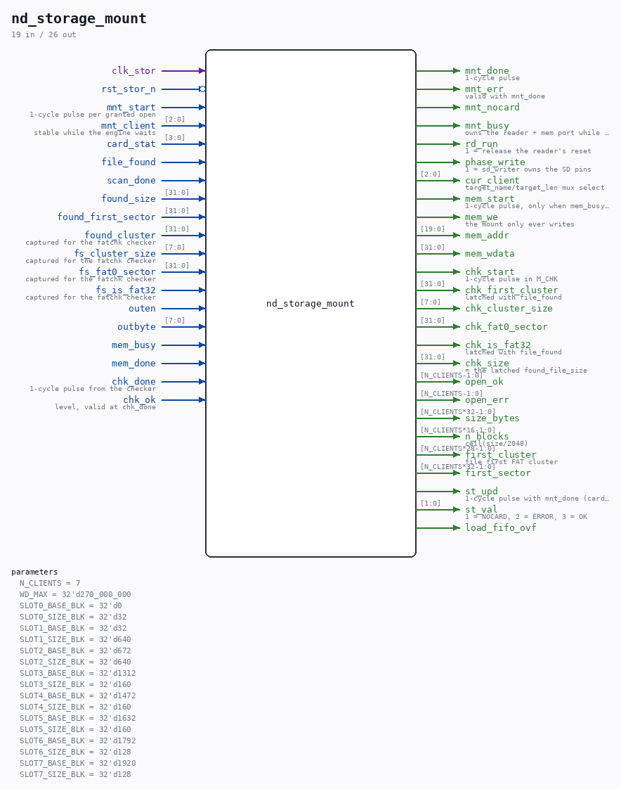

# nd_storage_mount

Source: `/mnt/e/Dev/Repos/Ronny/nd-120/Verilog/SD-FAT/circuit/nd_storage_mount.v`

> Generated by `Verilog/tests/module_doc.py` from the `//!`
> comments in the source. Do not edit by hand - edit the RTL comments and regenerate.

## Description

nd_storage open/preload FSM (mount)
Design: docs/nd-storage-design.md section 2.3; binding contract
docs/nd-storage-interface-spec.md sections 6 and 7. Invoked by the
block engine (nd_storage_engine.v) once per granted open request:
M_IDLE : wait for mnt_start; latch the client; clear that client's
open_ok/open_err (only a new open_req rebuilds a slot).
Phase 4: PRELOAD_MASK is gone, so every client in range
opens for real - only an out-of-range client index fails
here without touching the card.
M_INIT : phase_write<=0 (reader owns the SD pins), hold the reader
in reset a few more cycles, then release it for a FULL
init+mount+scan run - the per-open re-init that doubles
as the proven rewind/card-swap recovery.
M_CARD : wait for card init (card_stat >= 8); watchdog -> NOCARD.
M_SCAN : wait for file_found; latch size/first-sector/first-cluster
and geometry at the SAME edge (the ST_C_FIND lesson: the
reader is parked later and its registers reset with it).
Phase 4: NO size-versus-slot test - that refusal is what
made a 75 MB image impossible against a 256 KB slot - and
NO staging of the payload. The reader runs with
no_stream=1, so it stops at the directory match and this
state waits for its scan_done before parking. Waiting
matters: parking the reader mid-transfer leaves the card
streaming and the next card user (the contiguity checker,
or simply the next open) fails.
scan_done without file_found (missing file / bad FS) or
watchdog -> park + fail.
M_LOAD : DEAD under Phase 4 - unreachable, kept for one release so
the change stays reviewable against v1. It used to:
consume the outen/outbyte stream -> 4-byte big-endian
packer (byte 4m lands in mem_wdata[31:24]) -> 8x32 sync
FIFO -> mem-port writes at {SLOT_BASE_BLK[c],9'b0} +
byte_cnt[21:2]; the tail word is zero-padded. The FIFO
only absorbs jitter (1 byte per ~16-64 clk_stor from the
reader vs ~10-40 clk_stor per mem write); overflow sets
the sticky load_fifo_ovf flag the testbench asserts on.
M_PARK : reader back into reset, phase_write<=1 (sd_writer owns
the card again).
M_CHK  : SDFAT_STORAGE_CHECK contiguity gate (nd_storage_fatchk.v):
pulse chk_start once, wait for chk_done; chk_ok -> M_OK,
not ok (fragmented file / FAT read error) -> M_FAIL. The
failed open can simply be retried with a new open_req.
Without the feature flag the state passes straight through
to M_OK (the card recipe alone guarantees contiguity).
M_OK   : open_ok[c]<=1, size_bytes/n_blocks (=ceil(size/2048)) /
first_sector published, mnt_done with mnt_err=0.
SIZE CEILING: n_blocks is 16 bits, so an image >= 128 MiB
(2^27 B) is silently mis-sized - see the long note at the
r_nblk assignment. An image merely bigger than its drive
GEOMETRY is fine and is a different matter entirely.
M_FAIL : open_err[c]<=1, mnt_done with mnt_err=1.
open_ok stays up across later write errors (spec section 7); only a
new open_req for that client clears and rebuilds it (done here at
the M_IDLE handshake).
Everything runs in clk_stor. The mem port is muxed onto the shared
device port by the top (nd_storage.v) while mnt_busy is high; the
engine is parked in E_OPEN for that whole time by construction.
Last reviewed: 11-JUL-2026
Ronny Hansen

## Parameters

| Parameter | Default |
|---|---|
| `N_CLIENTS` | `7` |
| `WD_MAX` | `32'd270_000_000` |
| `SLOT0_BASE_BLK` | `32'd0` |
| `SLOT0_SIZE_BLK` | `32'd32` |
| `SLOT1_BASE_BLK` | `32'd32` |
| `SLOT1_SIZE_BLK` | `32'd640` |
| `SLOT2_BASE_BLK` | `32'd672` |
| `SLOT2_SIZE_BLK` | `32'd640` |
| `SLOT3_BASE_BLK` | `32'd1312` |
| `SLOT3_SIZE_BLK` | `32'd160` |
| `SLOT4_BASE_BLK` | `32'd1472` |
| `SLOT4_SIZE_BLK` | `32'd160` |
| `SLOT5_BASE_BLK` | `32'd1632` |
| `SLOT5_SIZE_BLK` | `32'd160` |
| `SLOT6_BASE_BLK` | `32'd1792` |
| `SLOT6_SIZE_BLK` | `32'd128` |
| `SLOT7_BASE_BLK` | `32'd1920` |
| `SLOT7_SIZE_BLK` | `32'd128` |

## Ports

| Direction | Width | Name | Description |
|---|---|---|---|
| input | `1` | `clk_stor` |  |
| input | `1` | `rst_stor_n` *(active low)* |  |
| input | `1` | `mnt_start` | 1-cycle pulse per granted open |
| input | `[2:0]` | `mnt_client` | stable while the engine waits |
| output | `1` | `mnt_done` | 1-cycle pulse |
| output | `1` | `mnt_err` | valid with mnt_done |
| output | `1` | `mnt_nocard` |  |
| output | `1` | `mnt_busy` | owns the reader + mem port while high |
| output | `1` | `rd_run` | 1 = release the reader's reset |
| output | `1` | `phase_write` | 1 = sd_writer owns the SD pins |
| output | `[2:0]` | `cur_client` | target_name/target_len mux select |
| input | `[3:0]` | `card_stat` |  |
| input | `1` | `file_found` |  |
| input | `1` | `scan_done` |  |
| input | `[31:0]` | `found_size` |  |
| input | `[31:0]` | `found_first_sector` |  |
| input | `[31:0]` | `found_cluster` | captured for the fatchk checker |
| input | `[7:0]` | `fs_cluster_size` | captured for the fatchk checker |
| input | `[31:0]` | `fs_fat0_sector` | captured for the fatchk checker |
| input | `1` | `fs_is_fat32` | captured for the fatchk checker |
| input | `1` | `outen` |  |
| input | `[7:0]` | `outbyte` |  |
| output | `1` | `mem_start` | 1-cycle pulse, only when mem_busy=0 |
| output | `1` | `mem_we` | the mount only ever writes |
| output | `[19:0]` | `mem_addr` |  |
| output | `[31:0]` | `mem_wdata` |  |
| input | `1` | `mem_busy` |  |
| input | `1` | `mem_done` |  |
| output | `1` | `chk_start` | 1-cycle pulse in M_CHK |
| input | `1` | `chk_done` | 1-cycle pulse from the checker |
| input | `1` | `chk_ok` | level, valid at chk_done |
| output | `[31:0]` | `chk_first_cluster` | latched with file_found |
| output | `[7:0]` | `chk_cluster_size` |  |
| output | `[31:0]` | `chk_fat0_sector` |  |
| output | `1` | `chk_is_fat32` | latched with file_found |
| output | `[31:0]` | `chk_size` | = the latched found_file_size |
| output | `[N_CLIENTS-1:0]` | `open_ok` |  |
| output | `[N_CLIENTS-1:0]` | `open_err` |  |
| output | `[N_CLIENTS*32-1:0]` | `size_bytes` |  |
| output | `[N_CLIENTS*16-1:0]` | `n_blocks` | ceil(size/2048) |
| output | `[N_CLIENTS*28-1:0]` | `first_cluster` | file first FAT cluster |
| output | `[N_CLIENTS*32-1:0]` | `first_sector` |  |
| output | `1` | `st_upd` | 1-cycle pulse with mnt_done (card was touched) |
| output | `[1:0]` | `st_val` | 1 = NOCARD, 2 = ERROR, 3 = OK |
| output | `1` | `load_fifo_ovf` |  |
