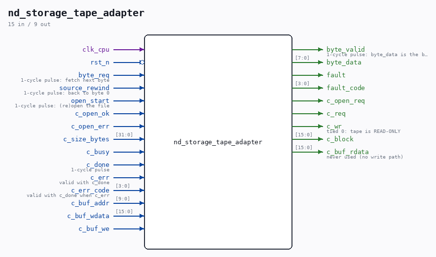

# nd_storage_tape_adapter

Source: `/mnt/e/Dev/Repos/Ronny/nd-120/Verilog/SD-FAT/circuit/nd_storage_tape_adapter.v`

> Generated by `Verilog/tests/module_doc.py` from the `//!`
> comments in the source. Do not edit by hand - edit the RTL comments and regenerate.

## Description

nd_storage_tape_adapter - byte-stream adapter for the paper-tape reader
Design doc: Verilog/docs/nd-storage-design.md section 2.5; spec
Verilog/docs/nd-storage-interface-spec.md section 5 (acceptance test 4).
Sits between ND_TAPE_400's byte source port (byte_req / byte_valid /
byte_data / source_rewind - pin-for-pin, see
Verilog/ND-BUS-DEVICES/TAPE-400/circuit/ND_TAPE_400.v) and ONE
nd_storage client port. Single clock: clk_cpu (the client-port domain
- the CDC lives inside nd_storage).
Behavior:
- keeps a 32-bit byte position s_bptr; block = s_bptr[26:11],
word-in-block = s_bptr[10:1]
- on byte_req: position past EOF (s_bptr >= c_size_bytes) or file
not open -> SILENCE (no byte_valid, no client-port traffic - the
tape's ready-for-transfer flag stays low, the C-model EOF
behavior). The zero-padded slot tail past EOF is never served.
- block hit (s_have_blk and s_cur_blk matches) -> serve from the
local 1024x16 block buffer: byte_valid pulse with
byte 2w = word[15:8], byte 2w+1 = word[7:0] (big-endian word
order, design doc 4.1 normative)
- miss -> one c_req block READ into the local buffer, then serve
- source_rewind: position back to 0, buffer invalidated; an
in-flight fetch is discarded on completion. NO card access - the
image lives in SDRAM.
- c_err on a fetch -> drop s_have_blk, stay silent (tape runout
semantics); the next byte_req simply retries the fetch.
WHY THIS ONE CANNOT TELL THE GUEST WHY IT STOPPED: the byte source
port is byte_req / byte_valid / byte_data / source_rewind and nothing
else - a real ND-400 paper tape reader has no register in which "the
SD card is missing" could be expressed, and inventing one would put a
signal on the card that its manual does not define. So the guest still
sees exactly the runout silence it saw before, and the reason is
instead published on the STICKY diagnostic pair fault / fault_code
(nd_storage_status.vh), which no ND logic reads - it exists for a
testbench, a probe or a board LED. Cleared by source_rewind and reset.
Without it, "the card fell out" and "you reached the end of the tape"
are the same event from every observation point.
READ-ONLY by construction: c_wr is tied 0 and c_buf_rdata is tied 0,
so the step-6 FLAG (never write the partial tail block of a file whose
size is not a 2048-byte multiple) holds trivially - there is no write
path at all.
open_start is a pulse from the board/boot logic; it is passed through
as a c_open_req pulse (nd_storage ignores it while the port is busy).
Last reviewed: 11-JUL-2026
Ronny Hansen

## Ports

| Direction | Width | Name | Description |
|---|---|---|---|
| input | `1` | `clk_cpu` |  |
| input | `1` | `rst_n` *(active low)* |  |
| input | `1` | `byte_req` | 1-cycle pulse: fetch next byte |
| output | `1` | `byte_valid` | 1-cycle pulse: byte_data is the byte |
| output | `[7:0]` | `byte_data` |  |
| input | `1` | `source_rewind` | 1-cycle pulse: back to byte 0 |
| output | `1` | `fault` |  |
| output | `[3:0]` | `fault_code` |  |
| input | `1` | `open_start` | 1-cycle pulse: (re)open the file |
| output | `1` | `c_open_req` |  |
| input | `1` | `c_open_ok` |  |
| input | `1` | `c_open_err` |  |
| input | `[31:0]` | `c_size_bytes` |  |
| output | `1` | `c_req` |  |
| output | `1` | `c_wr` | tied 0: tape is READ-ONLY |
| output | `[15:0]` | `c_block` |  |
| input | `1` | `c_busy` |  |
| input | `1` | `c_done` | 1-cycle pulse |
| input | `1` | `c_err` | valid with c_done |
| input | `[3:0]` | `c_err_code` | valid with c_done when c_err |
| input | `[9:0]` | `c_buf_addr` |  |
| input | `[15:0]` | `c_buf_wdata` |  |
| input | `1` | `c_buf_we` |  |
| output | `[15:0]` | `c_buf_rdata` | never used (no write path) |
