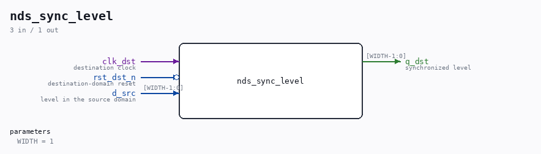

# nds_sync_level

Source: `/mnt/e/Dev/Repos/Ronny/nd-120/Verilog/SD-FAT/circuit/nds_sync.v`

> Generated by `Verilog/tests/module_doc.py` from the `//!`
> comments in the source. Do not edit by hand - edit the RTL comments and regenerate.

## Description

nd_storage CDC synchronizer primitives
The two small modules used by every clock-domain crossing in the
nd_storage stack (docs/nd-storage-design.md section 4.4: all
crossings are 2-flop and toggle-based).
nds_sync_pulse - toggle in, pulse out: the SOURCE domain flips a
toggle register; this module 2-flop-synchronizes the toggle into
the destination clock and emits a registered one-cycle pulse per
flip. Payload riding with the toggle must be held stable by the
source from the flip until the handshake answer returns: the
receiver samples it at the pulse, which is at least two
destination clocks after the flip landed.
nds_sync_level - plain 2-flop level synchronizer, WIDTH bits, for
quasi-static levels (open_ok, grant id, err flag). Multi-bit
values may only change while no consumer acts on them (the grant
id changes only while the word bridge is idle).
Source toggles must reset to 0 in their own domain: a toggle that is
already 1 when the destination leaves reset yields one spurious
pulse.
Last reviewed: 11-JUL-2026
Ronny Hansen

## Parameters

| Parameter | Default |
|---|---|
| `WIDTH` | `1` |

## Ports

| Direction | Width | Name | Description |
|---|---|---|---|
| input | `1` | `clk_dst` | destination clock |
| input | `1` | `rst_dst_n` *(active low)* | destination-domain reset |
| input | `[WIDTH-1:0]` | `d_src` | level in the source domain |
| output | `[WIDTH-1:0]` | `q_dst` | synchronized level |
