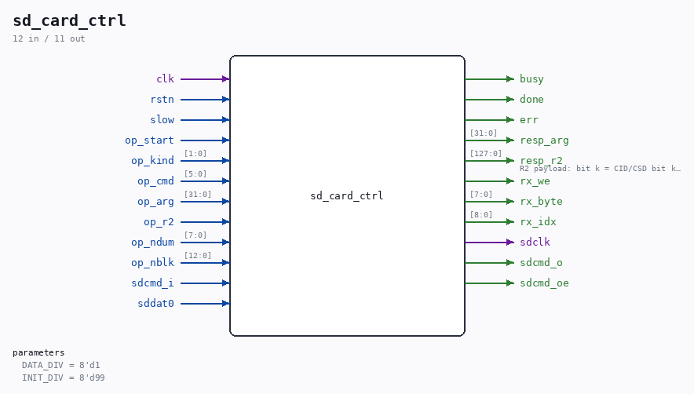

# sd_card_ctrl

Source: `/mnt/e/Dev/Repos/Ronny/nd-120/Verilog/SD-FAT/circuit/sd_file_reader.v`

> Generated by `Verilog/tests/module_doc.py` from the `//!`
> comments in the source. Do not edit by hand - edit the RTL comments and regenerate.

## Description

SD card init + FAT16/FAT32 mount + root-directory scan + file stream
ORIGINAL ND-120 project code (MIT, like the repository). CLEAN-ROOM
implementation from public specifications only: the SD Physical Layer
Simplified Specification (command framing, init sequence, response
formats, data-block framing) and the Microsoft FAT specification
(MBR/BPB layout, FAT12/16/32 thresholds, directory entries, VFAT long
file names). The command/data bit engine reuses the proven idiom of
this project's own sd_writer.v (tick-based bit clock, CRC functions,
48-bit command shifter).
One run per release of rstn (the consumers hold the module in reset
and release it per command - the rewind / card-swap recovery pattern):
1. card init at the identification clock (~137 kHz at 27 MHz):
74+ dummy clocks, CMD0, CMD8 (SDv2 detect), CMD55+ACMD41 loop
(HCS; CCS in the OCR selects SDHC block addressing), CMD2 (CID),
CMD3 (RCA), CMD9 (CSD - card_capacity_mb is decoded from it, both
CSD v1 and v2; a CMD9 timeout is tolerated and leaves it 0),
CMD7 (select) - then the DATA clock (clk/(2*CLK_DIV),
13.5 MHz at 27 MHz / CLK_DIV=1) - CMD16 (512-byte blocks).
card_stat counts the init steps; >= 8 means the card is ready.
2. mount: sector 0 is a DBR (superfloppy) or an MBR (the four
partition entries are walked for the first plausible volume);
the BPB gives the geometry. Cluster count < 4085 (FAT12) or a
malformed BPB = unmountable: scan_done without filesystem_type.
3. root directory scan (FAT16 linear region / FAT32 root cluster
chain, CMD17 per sector): every plain file and subdirectory is
reported on dir_entry_* (VFAT long name when a valid LFN chain
with a matching SFN checksum precedes the entry, else the 8.3
name, no trailing dot on extension-less names); deleted entries,
volume labels and hidden/system/read-only entries are skipped;
a 0x00 name byte ends the directory. target_name/target_len is
matched case-insensitively (target_len = 0 never matches: LIST
mode).
4. file streaming: the FAT chain is walked run by run (consecutive
clusters merge into one CMD18 multi-block read - the speed path;
a single-sector tail uses CMD17); every block's CRC16 is
verified; found_file_size bytes are emitted in order on
outen/outbyte.
5. scan_done (sticky level): file streamed, file not found after
the full scan, or unmountable filesystem.
No tristates (repo rule): CMD is exposed as sdcmd_i/_o/_oe; DAT0 is
never driven by this module (read-only core - writes live in
sd_writer.v).
CLK_DIV: data-phase half-period in clk cycles. 1 = clk/2 (13.5 MHz at
27 MHz, inside the mandatory 25 MHz default-speed limit); legacy
values >1 divide further (2 = clk/4 for 25-50 MHz clocks). The
identification clock is fixed near 137 kHz at 27 MHz (100-400 kHz
band). SIMULATE=1 shortens only the identification clock and the
power-up dummy-clock run (simulation card models answer immediately).
Last reviewed: 11-JUL-2026
Ronny Hansen

## Parameters

| Parameter | Default |
|---|---|
| `DATA_DIV` | `8'd1` |
| `INIT_DIV` | `8'd99` |

## Ports

| Direction | Width | Name | Description |
|---|---|---|---|
| input | `1` | `clk` |  |
| input | `1` | `rstn` |  |
| input | `1` | `slow` |  |
| input | `1` | `op_start` |  |
| input | `[1:0]` | `op_kind` |  |
| input | `[5:0]` | `op_cmd` |  |
| input | `[31:0]` | `op_arg` |  |
| input | `1` | `op_r2` |  |
| input | `[7:0]` | `op_ndum` |  |
| input | `[12:0]` | `op_nblk` |  |
| output | `1` | `busy` |  |
| output | `1` | `done` |  |
| output | `1` | `err` |  |
| output | `[31:0]` | `resp_arg` |  |
| output | `[127:0]` | `resp_r2` | R2 payload: bit k = CID/CSD bit k (k >= 1) |
| output | `1` | `rx_we` |  |
| output | `[7:0]` | `rx_byte` |  |
| output | `[8:0]` | `rx_idx` |  |
| output | `1` | `sdclk` |  |
| input | `1` | `sdcmd_i` |  |
| output | `1` | `sdcmd_o` |  |
| output | `1` | `sdcmd_oe` |  |
| input | `1` | `sddat0` |  |
