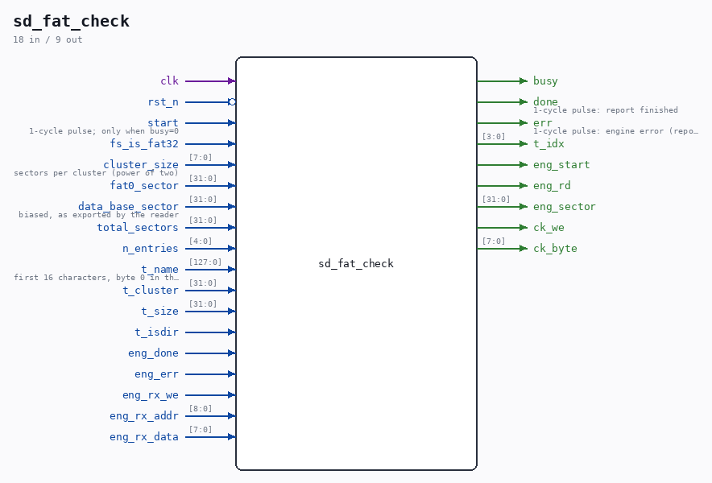

# sd_fat_check

Source: `/mnt/e/Dev/Repos/Ronny/nd-120/Verilog/SD-FAT/circuit/sd_fat_check.v`

> Generated by `Verilog/tests/module_doc.py` from the `//!`
> comments in the source. Do not edit by hand - edit the RTL comments and regenerate.

## Description

FAT cluster-chain validator ("fsck-lite")
Walks the cluster chain of every file in a table of root-directory
entries (captured by the caller during a directory scan) and emits an
ASCII report, one line per entry:
BOOT.BPUN        CL 00013AF2 LEN 00003 EXP 00003 OK
TEST.TXT         CL 00000002 LEN 00003 EXP 00003 OK
HDD              CL 00000004 DIR
CHECK DONE
LEN = clusters actually reachable by following the FAT until a proper
end-of-chain mark; EXP = ceil(size / cluster bytes). A chain that hits
a FREE entry, an out-of-range pointer or a loop, or whose length
differs from EXP, is flagged BAD - exactly the damage a wrong FAT
write leaves behind. Directories are listed but not walked (their
length is not derivable from the size field).
Uses the sd_writer engine in read mode (CMD17) on an already-
initialized card; the reader must be parked. Read-only - this module
never writes to the card.
This file is ORIGINAL ND-120 project code (MIT, like the repository).
Last reviewed: 11-JUL-2026
Ronny Hansen

## Ports

| Direction | Width | Name | Description |
|---|---|---|---|
| input | `1` | `clk` |  |
| input | `1` | `rst_n` *(active low)* |  |
| input | `1` | `start` | 1-cycle pulse; only when busy=0 |
| output | `1` | `busy` |  |
| output | `1` | `done` | 1-cycle pulse: report finished |
| output | `1` | `err` | 1-cycle pulse: engine error (report incomplete) |
| input | `1` | `fs_is_fat32` |  |
| input | `[7:0]` | `cluster_size` | sectors per cluster (power of two) |
| input | `[31:0]` | `fat0_sector` |  |
| input | `[31:0]` | `data_base_sector` | biased, as exported by the reader |
| input | `[31:0]` | `total_sectors` |  |
| input | `[4:0]` | `n_entries` |  |
| output | `[3:0]` | `t_idx` |  |
| input | `[127:0]` | `t_name` | first 16 characters, byte 0 in the low byte |
| input | `[31:0]` | `t_cluster` |  |
| input | `[31:0]` | `t_size` |  |
| input | `1` | `t_isdir` |  |
| output | `1` | `eng_start` |  |
| output | `1` | `eng_rd` |  |
| output | `[31:0]` | `eng_sector` |  |
| input | `1` | `eng_done` |  |
| input | `1` | `eng_err` |  |
| input | `1` | `eng_rx_we` |  |
| input | `[8:0]` | `eng_rx_addr` |  |
| input | `[7:0]` | `eng_rx_data` |  |
| output | `1` | `ck_we` |  |
| output | `[7:0]` | `ck_byte` |  |
