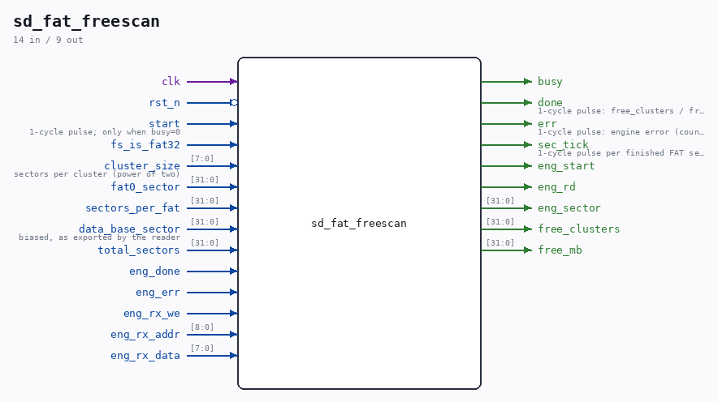

# sd_fat_freescan

Source: `/mnt/e/Dev/Repos/Ronny/nd-120/Verilog/SD-FAT/circuit/sd_fat_freescan.v`

> Generated by `Verilog/tests/module_doc.py` from the `//!`
> comments in the source. Do not edit by hand - edit the RTL comments and regenerate.

## Description

FAT free-space scanner
Reads FAT #0 sector by sector through the sd_writer engine (read mode,
CMD17) and counts the FREE entries (value 0) between cluster 2 and the
volume's last cluster - a FAT32 entry is masked to its low 28 bits, a
FAT16 entry is the full 16. The counting rides directly on the
engine's rx byte stream, so a sector costs no extra pass; the scan
stops with the sector that holds the last real cluster (a 32 GB FAT32
card is ~30k FAT sectors, roughly 10 s at the 13.5 MHz 1-bit engine
clock - the caller prints a SCANNING line first).
free_clusters  raw count
free_mb        free_clusters * cluster bytes / 1 MB (truncated)
Uses the engine on an already-initialized card; the reader must be
parked (the sd_fat_check.v pattern). Read-only - never writes.
This file is ORIGINAL ND-120 project code (MIT, like the repository).
Last reviewed: 11-JUL-2026
Ronny Hansen

## Ports

| Direction | Width | Name | Description |
|---|---|---|---|
| input | `1` | `clk` |  |
| input | `1` | `rst_n` *(active low)* |  |
| input | `1` | `start` | 1-cycle pulse; only when busy=0 |
| output | `1` | `busy` |  |
| output | `1` | `done` | 1-cycle pulse: free_clusters / free_mb valid |
| output | `1` | `err` | 1-cycle pulse: engine error (counts invalid) |
| output | `1` | `sec_tick` | 1-cycle pulse per finished FAT sector (watchdog) |
| input | `1` | `fs_is_fat32` |  |
| input | `[7:0]` | `cluster_size` | sectors per cluster (power of two) |
| input | `[31:0]` | `fat0_sector` |  |
| input | `[31:0]` | `sectors_per_fat` |  |
| input | `[31:0]` | `data_base_sector` | biased, as exported by the reader |
| input | `[31:0]` | `total_sectors` |  |
| output | `1` | `eng_start` |  |
| output | `1` | `eng_rd` |  |
| output | `[31:0]` | `eng_sector` |  |
| input | `1` | `eng_done` |  |
| input | `1` | `eng_err` |  |
| input | `1` | `eng_rx_we` |  |
| input | `[8:0]` | `eng_rx_addr` |  |
| input | `[7:0]` | `eng_rx_data` |  |
| output | `[31:0]` | `free_clusters` |  |
| output | `[31:0]` | `free_mb` |  |
