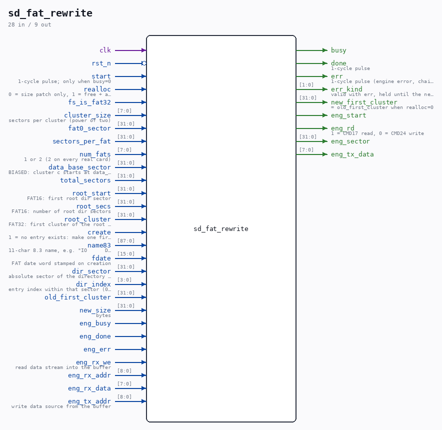

# sd_fat_rewrite

Source: `/mnt/e/Dev/Repos/Ronny/nd-120/Verilog/SD-FAT/circuit/sd_fat_rewrite.v`

> Generated by `Verilog/tests/module_doc.py` from the `//!`
> comments in the source. Do not edit by hand - edit the RTL comments and regenerate.

## Description

FAT16/FAT32 in-place file replacement ("delete + recreate")
Given a file's directory entry location and the filesystem geometry
(all exported by the modified sd_file_reader after a successful scan),
this module makes the file exactly new_size bytes long:
realloc = 0 (target's allocation already big enough):
- patch the SIZE field of the directory entry only
create = 1 (the file does not exist yet):
- scan the root directory for a free 32-byte slot (FAT16 linear
region / FAT32 root cluster chain) and write a fresh 8.3 entry
(name, Archive attribute, fixed date, zero size/cluster), then
proceed exactly like realloc=1
realloc = 1 (full replacement):
- FREE the file's old cluster chain (both FAT copies)
- SCAN the FAT for a CONTIGUOUS run of enough free clusters
- WRITE the new chain (both FAT copies)
- patch the directory entry: size + first cluster
The caller then writes the data sectors (the new chain is contiguous,
first data sector = data_base_sector + cluster_size * new_first).
All sector traffic goes through one sd_writer engine (CMD17 reads +
CMD24 writes) on an already-initialized card; an internal 512-byte
buffer holds the sector being read-modify-written.
Scope limits (documented in SD-FAT/README.md):
- the new chain is contiguous (fails with err if no contiguous run
of free clusters exists - "no space")
- FAT32: the FSInfo free-cluster count is NOT updated (fsck reports
and fixes the summary; the filesystem itself stays consistent),
and files beyond cluster 65535 are out of reach (reader limit)
- directory entry name/date are left untouched
This file is ORIGINAL ND-120 project code (MIT, like the repository).
Last reviewed: 11-JUL-2026
Ronny Hansen

## Ports

| Direction | Width | Name | Description |
|---|---|---|---|
| input | `1` | `clk` |  |
| input | `1` | `rst_n` *(active low)* |  |
| input | `1` | `start` | 1-cycle pulse; only when busy=0 |
| input | `1` | `realloc` | 0 = size patch only, 1 = free + allocate + patch |
| output | `1` | `busy` |  |
| output | `1` | `done` | 1-cycle pulse |
| output | `1` | `err` | 1-cycle pulse (engine error, chain loop, no space) |
| output | `[1:0]` | `err_kind` | valid with err, held until the next start: |
| input | `1` | `fs_is_fat32` |  |
| input | `[7:0]` | `cluster_size` | sectors per cluster (power of two) |
| input | `[31:0]` | `fat0_sector` |  |
| input | `[31:0]` | `sectors_per_fat` |  |
| input | `[7:0]` | `num_fats` | 1 or 2 (2 on every real card) |
| input | `[31:0]` | `data_base_sector` | BIASED: cluster c starts at data_base + cluster_size*c |
| input | `[31:0]` | `total_sectors` |  |
| input | `[31:0]` | `root_start` | FAT16: first root dir sector |
| input | `[31:0]` | `root_secs` | FAT16: number of root dir sectors |
| input | `[31:0]` | `root_cluster` | FAT32: first cluster of the root dir |
| input | `1` | `create` | 1 = no entry exists: make one first |
| input | `[87:0]` | `name83` | 11-char 8.3 name, e.g. "IO      DAT" |
| input | `[15:0]` | `fdate` | FAT date word stamped on creation |
| input | `[31:0]` | `dir_sector` | absolute sector of the directory entry |
| input | `[3:0]` | `dir_index` | entry index within that sector (0-15) |
| input | `[31:0]` | `old_first_cluster` |  |
| input | `[31:0]` | `new_size` | bytes |
| output | `[31:0]` | `new_first_cluster` | = old_first_cluster when realloc=0 |
| output | `1` | `eng_start` |  |
| output | `1` | `eng_rd` | 1 = CMD17 read, 0 = CMD24 write |
| output | `[31:0]` | `eng_sector` |  |
| input | `1` | `eng_busy` |  |
| input | `1` | `eng_done` |  |
| input | `1` | `eng_err` |  |
| input | `1` | `eng_rx_we` | read data stream into the buffer |
| input | `[8:0]` | `eng_rx_addr` |  |
| input | `[7:0]` | `eng_rx_data` |  |
| input | `[8:0]` | `eng_tx_addr` | write data source from the buffer |
| output | `[7:0]` | `eng_tx_data` |  |
