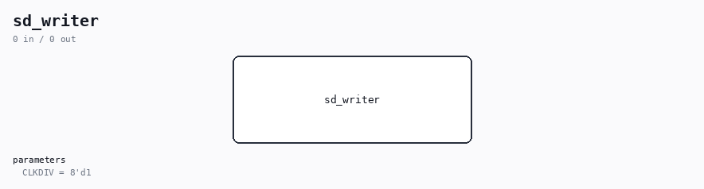

# sd_writer

Source: `/mnt/e/Dev/Repos/Ronny/nd-120/Verilog/SD-FAT/circuit/sd_writer.v`

> Generated by `Verilog/tests/module_doc.py` from the `//!`
> comments in the source. Do not edit by hand - edit the RTL comments and regenerate.

## Description

SD sector read/write engine (single + multi-block, SD-native 1-bit)
Reads or writes sectors on an ALREADY-INITIALIZED card: the reader
(sd_reader.v) must have brought the card into the transfer state with
512-byte block length before this module is used; the top level then
muxes the SD pins from the reader to this engine. Used for the ND-120
in-place file rewrite path (SD-FAT/README.md): data-sector writes plus
the FAT/directory read-modify-writes of sd_fat_rewrite.v, and for the
CMD18/CMD25 burst speed path of the sd-fat-test menus 6/7.
Protocol per SD Physical Layer Simplified Spec:
single read:  CMD17(sector) -> R1 -> DAT0: start(0)+4096 bits+CRC+end
single write: CMD24(sector) -> R1 -> Nwr gap -> DAT0: start(0)+4096
data bits MSB-first + CRC16-CCITT + end(1) -> card CRC status
token on DAT0 (start 0, "010" = accepted, end 1) -> card busy
(DAT0 low) -> ready.
burst read  (burst_len>1): CMD18 -> R1 -> blocks stream back-to-back
(each start+4096+CRC16+end) -> host stops with CMD12 (R1).
burst write (burst_len>1): CMD55(RCA)+ACMD23(count) -> CMD25 -> R1
-> per block: Nwr gap + start+4096+CRC16+end -> CRC status token
-> busy release -> next block; burst ends with CMD12 (R1b + final
busy). A "101"/"110" status mid-burst aborts via CMD12 and
reports err (the caller retries).
Per-block caller handshake: rd_addr/rd_data (write source) and
rx_we/rx_addr/rx_data (read sink) restart at byte 0 for every block;
block_next pulses one cycle between the blocks of a burst so the
caller advances its block context (never before block 0 - the first
block always uses the context that was valid at start). done fires
once, at burst end.
burst_len = 0 or 1 (or left unconnected) is EXACTLY the original
single-sector CMD17/CMD24 engine - nd_storage and the COPY/WRBLK1
paths use that interface unchanged.
4-bit bus mode (use_4bit=1, speed-plan rung c): every operation is
prefixed with CMD55(RCA)+ACMD6(arg 2) - the card may have been
re-initialized to 1-bit by the reader between operations, so the
switch is repeated per op (two 48-bit commands, negligible against a
sector). Data blocks then move as 1024 nibbles on DAT3..DAT0 (MSB
nibble first, DAT3 = bit 3): start nibble 0, data, 16 CRC clocks
where EACH line carries its own CRC16 over the serial bits that line
carried, end nibble F. The CRC status token and ALL busy signalling
stay on DAT0 alone (SD Physical Layer spec) - those states are shared
with the 1-bit path. use_4bit=0 (or unconnected: an x/z condition is
false) is the original 1-bit engine, bit-exact - nd_storage and the
Basys3 PMOD (DAT0-only wiring) keep working unchanged.
No tristates here (repo rule): the CMD/DAT drivers are exposed as
_o/_oe pairs and the single tristate lives at the board top level.
DAT1-3 are driven ONLY during the data phase of a 4-bit write (the
host never drives any DAT line during reads or status/busy).
Burst-read block boundaries: the spec's N_AC minimum is 2 sdclk, so a
real card streams blocks nearly back-to-back. The start-bit hunt in
R_DWAIT is armed on the sdclk right after the previous end bit, and
as belt-and-braces the sdclk LOW phase is stretched a few clocks at
each boundary (host-side clock flow control, spec section 4.4 - the
card freezes while the clock is held) so no start bit can ever arrive
before the hunt is armed. A partial next block streamed by the card
before CMD12 lands is ignored by design (the FSM is in the command
states; the card releases DAT shortly after the CMD12 end bit).
This file is ORIGINAL ND-120 project code (MIT, like the repository);
it is intentionally independent of the vendored GPL SD reader.
Sector data is fetched through a registered read port (1-clk latency);
the SD bit clock is at least two system clocks long, so the fetch
pipeline is satisfied even at CLKDIV=1 (16 clk between byte fetches).
Last reviewed: 11-JUL-2026
Ronny Hansen

## Parameters

| Parameter | Default |
|---|---|
| `CLKDIV` | `8'd1` |
