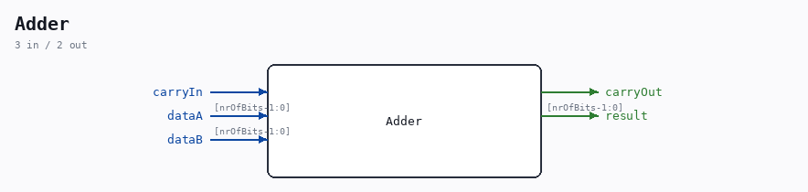

# Adder

Source: `/mnt/e/Dev/Repos/Ronny/nd-120/Verilog/Shared/logisim/Adder.v`

> Generated by `Verilog/tests/module_doc.py` from the `//!`
> comments in the source. Do not edit by hand - edit the RTL comments and regenerate.

## Description

Component : Adder

## Ports

| Direction | Width | Name | Description |
|---|---|---|---|
| input | `1` | `carryIn` |  |
| output | `1` | `carryOut` |  |
| input | `[nrOfBits-1:0]` | `dataA` |  |
| input | `[nrOfBits-1:0]` | `dataB` |  |
| output | `[nrOfBits-1:0]` | `result` |  |
