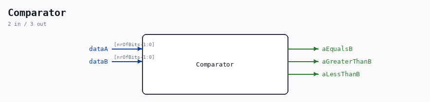

# Comparator

Source: `/mnt/e/Dev/Repos/Ronny/nd-120/Verilog/Shared/logisim/Comparator.v`

> Generated by `Verilog/tests/module_doc.py` from the `//!`
> comments in the source. Do not edit by hand - edit the RTL comments and regenerate.

## Description

ND120 Shared
Component: Comparator
Last reviewed: 2-FEB-2025
Ronny Hansen

## Ports

| Direction | Width | Name | Description |
|---|---|---|---|
| output | `1` | `aEqualsB` |  |
| output | `1` | `aGreaterThanB` |  |
| output | `1` | `aLessThanB` |  |
| input | `[nrOfBits-1:0]` | `dataA` |  |
| input | `[nrOfBits-1:0]` | `dataB` |  |
