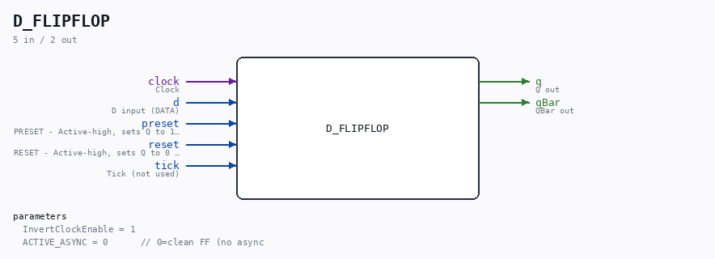

# D_FLIPFLOP

Source: `/mnt/e/Dev/Repos/Ronny/nd-120/Verilog/Shared/logisim/D_FLIPFLOP.v`

> Generated by `Verilog/tests/module_doc.py` from the `//!`
> comments in the source. Do not edit by hand - edit the RTL comments and regenerate.

## Description

ND120 SHARED CODE
D FLIP-FLOP
ACTIVE_ASYNC=0 (default): Clean synchronous FF for FPGA.
ACTIVE_ASYNC=1: Async preset/reset for instances that need it.
Last reviewed: 30-MAR-2026
Ronny Hansen

## Parameters

| Parameter | Default |
|---|---|
| `InvertClockEnable` | `1` |
| `ACTIVE_ASYNC` | `0      // 0=clean FF (no async` |

## Ports

| Direction | Width | Name | Description |
|---|---|---|---|
| input | `1` | `clock` | Clock |
| input | `1` | `d` | D input (DATA) |
| input | `1` | `preset` | PRESET - Active-high, sets Q to 1 when asserted |
| input | `1` | `reset` | RESET - Active-high, sets Q to 0 when asserted |
| input | `1` | `tick` | Tick (not used) |
| output | `1` | `q` | Q out |
| output | `1` | `qBar` | QBar out |
