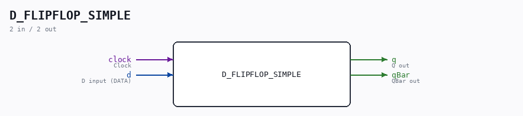

# D_FLIPFLOP_SIMPLE

Source: `/mnt/e/Dev/Repos/Ronny/nd-120/Verilog/Shared/logisim/D_FLIPFLOP_SIMPLE.v`

> Generated by `Verilog/tests/module_doc.py` from the `//!`
> comments in the source. Do not edit by hand - edit the RTL comments and regenerate.

## Description

ND120 SHARED CODE
D FLIP-FLOP (Wihtout SET or RESET)
Last reviewed: 9-FEB-2025
Ronny Hansen

## Ports

| Direction | Width | Name | Description |
|---|---|---|---|
| input | `1` | `clock` | Clock |
| input | `1` | `d` | D input (DATA) |
| output | `1` | `q` | Q out |
| output | `1` | `qBar` | QBar out |
