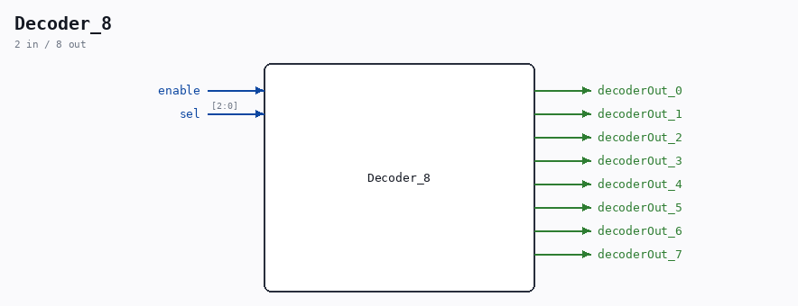

# Decoder_8

Source: `/mnt/e/Dev/Repos/Ronny/nd-120/Verilog/Shared/logisim/Decoder_8.v`

> Generated by `Verilog/tests/module_doc.py` from the `//!`
> comments in the source. Do not edit by hand - edit the RTL comments and regenerate.

## Description

Component : Decoder_8

## Ports

| Direction | Width | Name | Description |
|---|---|---|---|
| input | `1` | `enable` |  |
| input | `[2:0]` | `sel` |  |
| output | `1` | `decoderOut_0` |  |
| output | `1` | `decoderOut_1` |  |
| output | `1` | `decoderOut_2` |  |
| output | `1` | `decoderOut_3` |  |
| output | `1` | `decoderOut_4` |  |
| output | `1` | `decoderOut_5` |  |
| output | `1` | `decoderOut_6` |  |
| output | `1` | `decoderOut_7` |  |
