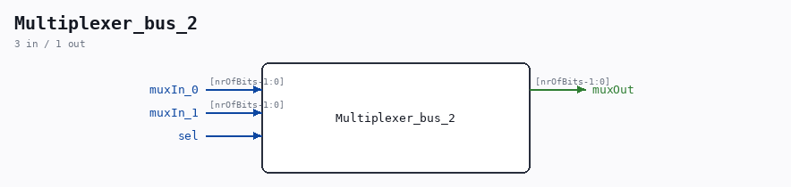

# Multiplexer_bus_2

Source: `/mnt/e/Dev/Repos/Ronny/nd-120/Verilog/Shared/logisim/Multiplexer_bus_2.v`

> Generated by `Verilog/tests/module_doc.py` from the `//!`
> comments in the source. Do not edit by hand - edit the RTL comments and regenerate.

## Description

Component : Multiplexer_bus_2

## Ports

| Direction | Width | Name | Description |
|---|---|---|---|
| input | `[nrOfBits-1:0]` | `muxIn_0` |  |
| input | `[nrOfBits-1:0]` | `muxIn_1` |  |
| input | `1` | `sel` |  |
| output | `[nrOfBits-1:0]` | `muxOut` |  |
