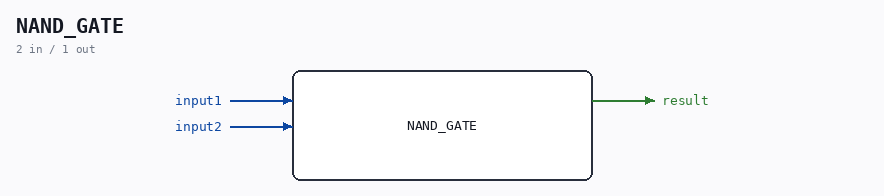

# NAND_GATE

Source: `/mnt/e/Dev/Repos/Ronny/nd-120/Verilog/Shared/logisim/NAND_GATE.v`

> Generated by `Verilog/tests/module_doc.py` from the `//!`
> comments in the source. Do not edit by hand - edit the RTL comments and regenerate.

## Description

Logisim-evolution goes FPGA automatic generated Verilog code
https://github.com/logisim-evolution/
Component : NAND_GATE

## Ports

| Direction | Width | Name | Description |
|---|---|---|---|
| input | `1` | `input1` |  |
| input | `1` | `input2` |  |
| output | `1` | `result` |  |
