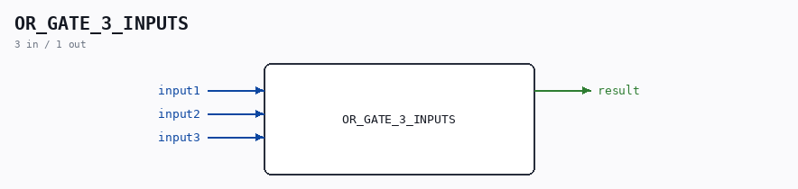

# OR_GATE_3_INPUTS

Source: `/mnt/e/Dev/Repos/Ronny/nd-120/Verilog/Shared/logisim/OR_GATE_3_INPUTS.v`

> Generated by `Verilog/tests/module_doc.py` from the `//!`
> comments in the source. Do not edit by hand - edit the RTL comments and regenerate.

## Description

Logisim-evolution goes FPGA automatic generated Verilog code
https://github.com/logisim-evolution/
Component : OR_GATE_3_INPUTS

## Ports

| Direction | Width | Name | Description |
|---|---|---|---|
| input | `1` | `input1` |  |
| input | `1` | `input2` |  |
| input | `1` | `input3` |  |
| output | `1` | `result` |  |
