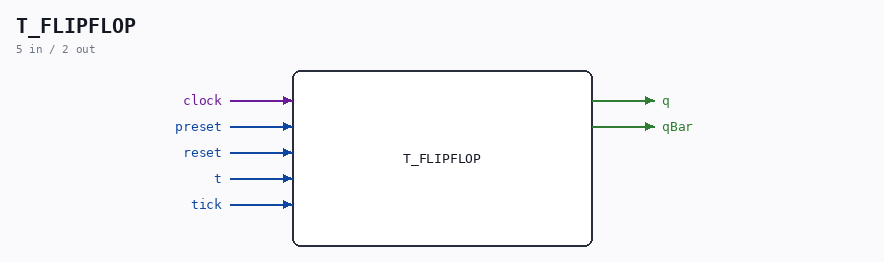

# T_FLIPFLOP

Source: `/mnt/e/Dev/Repos/Ronny/nd-120/Verilog/Shared/logisim/T_FLIPFLOP.v`

> Generated by `Verilog/tests/module_doc.py` from the `//!`
> comments in the source. Do not edit by hand - edit the RTL comments and regenerate.

## Description

Logisim-evolution goes FPGA automatic generated Verilog code
https://github.com/logisim-evolution/
Component : T_FLIPFLOP

## Ports

| Direction | Width | Name | Description |
|---|---|---|---|
| input | `1` | `clock` |  |
| input | `1` | `preset` |  |
| output | `1` | `q` |  |
| output | `1` | `qBar` |  |
| input | `1` | `reset` |  |
| input | `1` | `t` |  |
| input | `1` | `tick` |  |
