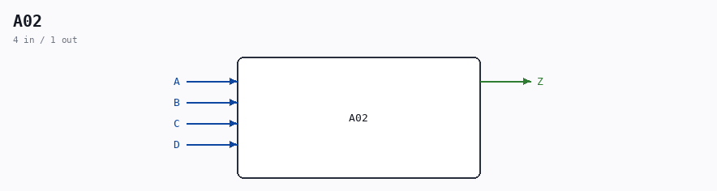

# A02

Source: `/mnt/e/Dev/Repos/Ronny/nd-120/Verilog/Shared/ndlib/A02.v`

> Generated by `Verilog/tests/module_doc.py` from the `//!`
> comments in the source. Do not edit by hand - edit the RTL comments and regenerate.

## Description

ND120 CPU, MM&M
CGA A02 component
Used in CHG/ALU page 61
From Lasse Bockelie:
AO2 is an And Or Invert gate. So 2 And followed by an Or gate and then inverted.
The function is a selector (multiplexer) of each of the 4 16-bit signal groups.
AO2 was a component of LSI Logic's library on Daisy.
The symbol for it was like in your drawing, but we didn't have room for that.
We could also make our own components on Daisy, so I made the shrunken one.
As you can see, there wasn't even room for the title field on this page
Last reviewed: 09-NOV-2024
Ronny Hansen

## Ports

| Direction | Width | Name | Description |
|---|---|---|---|
| input | `1` | `A` |  |
| input | `1` | `B` |  |
| input | `1` | `C` |  |
| input | `1` | `D` |  |
| output | `1` | `Z` |  |
