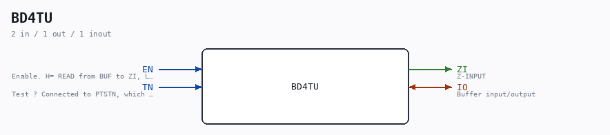

# BD4TU

Source: `/mnt/e/Dev/Repos/Ronny/nd-120/Verilog/Shared/ndlib/BD4TU.v`

> Generated by `Verilog/tests/module_doc.py` from the `//!`
> comments in the source. Do not edit by hand - edit the RTL comments and regenerate.

## Description

Component : BD4TU
Databufffer with 3-state
Used in CGA (Sheet 5/10) page 6
In the drawings the read bufffer is connected to "PTREE1" for read-enable
Which is connected to 1/HIGH. Not really sure what thus migth mean.
Ronny Hansen 14.01.2023

## Ports

| Direction | Width | Name | Description |
|---|---|---|---|
| inout | `1` | `IO` | Buffer input/output |
| input | `1` | `EN` | Enable. H= READ from BUF to ZI, L= WRITE from A to BUF |
| input | `1` | `TN` | Test ? Connected to PTSTN, which is always 1/HIGH |
| output | `1` | `ZI` | Z-INPUT |
