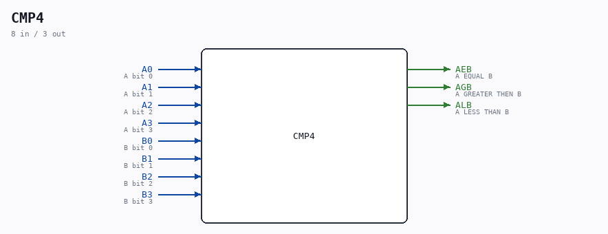

# CMP4

Source: `/mnt/e/Dev/Repos/Ronny/nd-120/Verilog/Shared/ndlib/CMP4.v`

> Generated by `Verilog/tests/module_doc.py` from the `//!`
> comments in the source. Do not edit by hand - edit the RTL comments and regenerate.

## Description

ND120 Shared
Component: CMP4 (4 bit comparator)
Last reviewed: 9-NOV-2024
Ronny Hansen

## Ports

| Direction | Width | Name | Description |
|---|---|---|---|
| input | `1` | `A0` | A bit 0 |
| input | `1` | `A1` | A bit 1 |
| input | `1` | `A2` | A bit 2 |
| input | `1` | `A3` | A bit 3 |
| input | `1` | `B0` | B bit 0 |
| input | `1` | `B1` | B bit 1 |
| input | `1` | `B2` | B bit 2 |
| input | `1` | `B3` | B bit 3 |
| output | `1` | `AEB` | A EQUAL B |
| output | `1` | `AGB` | A GREATER THEN B |
| output | `1` | `ALB` | A LESS THAN B |
