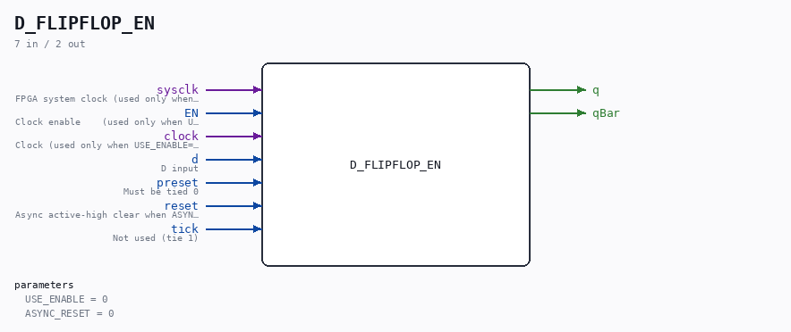

# D_FLIPFLOP_EN

Source: `/mnt/e/Dev/Repos/Ronny/nd-120/Verilog/Shared/ndlib/D_FLIPFLOP_EN.v`

> Generated by `Verilog/tests/module_doc.py` from the `//!`
> comments in the source. Do not edit by hand - edit the RTL comments and regenerate.

## Description

ND120 Shared
D_FLIPFLOP_EN - D_FLIPFLOP with an optional clock-enable mode.
USE_ENABLE=0 (default): wraps the original D_FLIPFLOP - posedge
clock, original behaviour.
USE_ENABLE=1: posedge sysclk, captures when EN is high (P2 clock-
domain conversion mode - see SCAN_FF_EN.v / the plan doc).
USE_ENABLE=2: strobe edge-capture - `clock` carries a control strobe,
not a clock; capture d on a sysclk-detected rise of `clock` (P3
mode, AM29C821 USE_SYSCLK=2 pattern). EN is unused (tie 0).
ASYNC_RESET=0 (default): preset/reset must be tied 0 (clean sync
flop, InvertClockEnable=0).
ASYNC_RESET=1: preset/reset are async active-high set/clear with
preset priority, like the original D_FLIPFLOP with ACTIVE_ASYNC(1).
tick is unused (tie 1).
Last reviewed: 10-JUL-2026
Ronny Hansen

## Parameters

| Parameter | Default |
|---|---|
| `USE_ENABLE` | `0` |
| `ASYNC_RESET` | `0` |

## Ports

| Direction | Width | Name | Description |
|---|---|---|---|
| input | `1` | `sysclk` | FPGA system clock (used only when USE_ENABLE=1) |
| input | `1` | `EN` | Clock enable    (used only when USE_ENABLE=1) |
| input | `1` | `clock` | Clock (used only when USE_ENABLE=0) |
| input | `1` | `d` | D input |
| input | `1` | `preset` | Must be tied 0 |
| input | `1` | `reset` | Async active-high clear when ASYNC_RESET=1, else tie 0 |
| input | `1` | `tick` | Not used (tie 1) |
| output | `1` | `q` |  |
| output | `1` | `qBar` |  |
