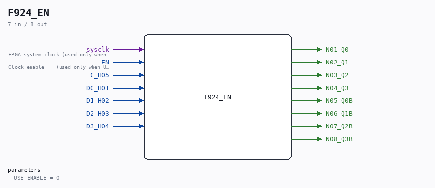

# F924_EN

Source: `/mnt/e/Dev/Repos/Ronny/nd-120/Verilog/Shared/ndlib/F924_EN.v`

> Generated by `Verilog/tests/module_doc.py` from the `//!`
> comments in the source. Do not edit by hand - edit the RTL comments and regenerate.

## Description

ND120 Shared
F924_EN - F924 (NEC 4-bit D-type flip-flop) with an optional
clock-enable mode.
USE_ENABLE=0 (default): wraps the original F924 - posedge C_H05,
original behaviour.
USE_ENABLE=1: posedge sysclk, captures when EN is high (P2 clock-
domain conversion mode - see SCAN_FF_EN.v / the plan doc). This
branch is a STRUCTURAL COPY of the original F924 body - every
wire and assign identical - with only the four internal flops
swapped from D_FLIPFLOP #(.InvertClockEnable(0)) to
D_FLIPFLOP_EN #(.USE_ENABLE(1)) (default ASYNC_RESET=0; the
originals tie preset/reset to 0 and tick to 1, preserved here).
The C_H05 pin is routed to the flops' (unused-in-mode-1) clock
pins.
Last reviewed: 10-JUL-2026
Ronny Hansen

## Parameters

| Parameter | Default |
|---|---|
| `USE_ENABLE` | `0` |

## Ports

| Direction | Width | Name | Description |
|---|---|---|---|
| input | `1` | `sysclk` | FPGA system clock (used only when USE_ENABLE=1) |
| input | `1` | `EN` | Clock enable    (used only when USE_ENABLE=1) |
| input | `1` | `C_H05` |  |
| input | `1` | `D0_H01` |  |
| input | `1` | `D1_H02` |  |
| input | `1` | `D2_H03` |  |
| input | `1` | `D3_H04` |  |
| output | `1` | `N01_Q0` |  |
| output | `1` | `N02_Q1` |  |
| output | `1` | `N03_Q2` |  |
| output | `1` | `N04_Q3` |  |
| output | `1` | `N05_Q0B` |  |
| output | `1` | `N06_Q1B` |  |
| output | `1` | `N07_Q2B` |  |
| output | `1` | `N08_Q3B` |  |
