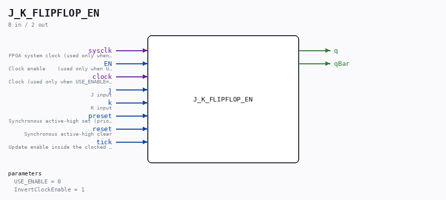

# J_K_FLIPFLOP_EN

Source: `/mnt/e/Dev/Repos/Ronny/nd-120/Verilog/Shared/ndlib/J_K_FLIPFLOP_EN.v`

> Generated by `Verilog/tests/module_doc.py` from the `//!`
> comments in the source. Do not edit by hand - edit the RTL comments and regenerate.

## Description

ND120 Shared
J_K_FLIPFLOP_EN - J_K_FLIPFLOP with an optional clock-enable mode.
USE_ENABLE=0 (default): wraps the original J_K_FLIPFLOP - clocked on
the original clock pin (InvertClockEnable passed through),
bit-for-bit the original behaviour.
USE_ENABLE=1: clocked on posedge sysclk, updates when EN is high
(P2 clock-domain conversion mode - see SCAN_FF_EN.v / the plan
doc). The clock pin is unused in this mode. preset/reset stay
SYNCHRONOUS, exactly as in the original clocked block, with the
original priority: preset > reset > tick.
Last reviewed: 10-JUL-2026
Ronny Hansen

## Parameters

| Parameter | Default |
|---|---|
| `USE_ENABLE` | `0` |
| `InvertClockEnable` | `1` |

## Ports

| Direction | Width | Name | Description |
|---|---|---|---|
| input | `1` | `sysclk` | FPGA system clock (used only when USE_ENABLE=1) |
| input | `1` | `EN` | Clock enable    (used only when USE_ENABLE=1) |
| input | `1` | `clock` | Clock (used only when USE_ENABLE=0) |
| input | `1` | `j` | J input |
| input | `1` | `k` | K input |
| input | `1` | `preset` | Synchronous active-high set (priority over reset) |
| input | `1` | `reset` | Synchronous active-high clear |
| input | `1` | `tick` | Update enable inside the clocked block |
| output | `1` | `q` |  |
| output | `1` | `qBar` |  |
