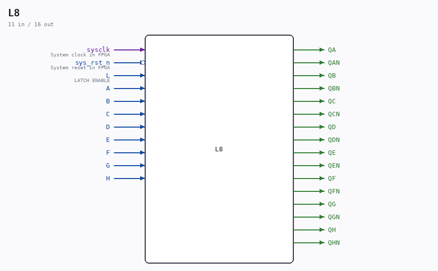

# L8

Source: `/mnt/e/Dev/Repos/Ronny/nd-120/Verilog/Shared/ndlib/L8.v`

> Generated by `Verilog/tests/module_doc.py` from the `//!`
> comments in the source. Do not edit by hand - edit the RTL comments and regenerate.

## Description

ND120 Shared
Component L8 (8-bit latch)
Last reviewed: 9-FEB-2025
Ronny Hansen

## Ports

| Direction | Width | Name | Description |
|---|---|---|---|
| input | `1` | `sysclk` | System clock in FPGA |
| input | `1` | `sys_rst_n` *(active low)* | System reset in FPGA |
| input | `1` | `L` | LATCH ENABLE |
| input | `1` | `A` |  |
| input | `1` | `B` |  |
| input | `1` | `C` |  |
| input | `1` | `D` |  |
| input | `1` | `E` |  |
| input | `1` | `F` |  |
| input | `1` | `G` |  |
| input | `1` | `H` |  |
| output | `1` | `QA` |  |
| output | `1` | `QAN` |  |
| output | `1` | `QB` |  |
| output | `1` | `QBN` |  |
| output | `1` | `QC` |  |
| output | `1` | `QCN` |  |
| output | `1` | `QD` |  |
| output | `1` | `QDN` |  |
| output | `1` | `QE` |  |
| output | `1` | `QEN` |  |
| output | `1` | `QF` |  |
| output | `1` | `QFN` |  |
| output | `1` | `QG` |  |
| output | `1` | `QGN` |  |
| output | `1` | `QH` |  |
| output | `1` | `QHN` |  |
