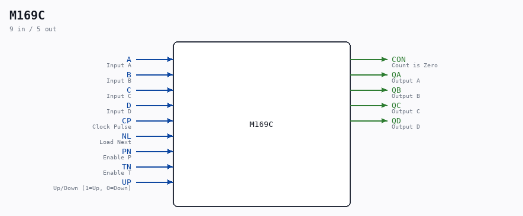

# M169C

Source: `/mnt/e/Dev/Repos/Ronny/nd-120/Verilog/Shared/ndlib/M169C.v`

> Generated by `Verilog/tests/module_doc.py` from the `//!`
> comments in the source. Do not edit by hand - edit the RTL comments and regenerate.

## Description

ND120 Shared
M169C - 74LS169 - Synchronous 4-bit up/down binary counters
https://www.ti.com/lit/ds/symlink/sn74als169b.pdf
Last reviewed: 2-FEB-2025
Ronny Hansen

## Ports

| Direction | Width | Name | Description |
|---|---|---|---|
| input | `1` | `A` | Input A |
| input | `1` | `B` | Input B |
| input | `1` | `C` | Input C |
| input | `1` | `D` | Input D |
| input | `1` | `CP` | Clock Pulse |
| input | `1` | `NL` | Load Next |
| input | `1` | `PN` | Enable P |
| input | `1` | `TN` | Enable T |
| input | `1` | `UP` | Up/Down (1=Up, 0=Down) |
| output | `1` | `CON` | Count is Zero |
| output | `1` | `QA` | Output A |
| output | `1` | `QB` | Output B |
| output | `1` | `QC` | Output C |
| output | `1` | `QD` | Output D |
