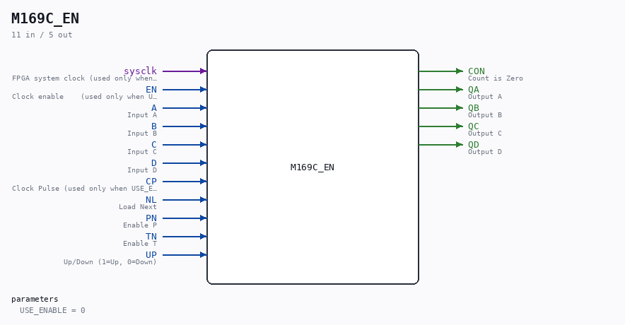

# M169C_EN

Source: `/mnt/e/Dev/Repos/Ronny/nd-120/Verilog/Shared/ndlib/M169C_EN.v`

> Generated by `Verilog/tests/module_doc.py` from the `//!`
> comments in the source. Do not edit by hand - edit the RTL comments and regenerate.

## Description

ND120 Shared
M169C_EN - M169C (74LS169 synchronous 4-bit up/down binary counter)
with an optional clock-enable mode.
USE_ENABLE=0 (default): wraps the original M169C - posedge CP,
original behaviour.
USE_ENABLE=1: posedge sysclk, counts when EN is high (P2 clock-
domain conversion mode - see SCAN_FF_EN.v / the plan doc). This
branch is a STRUCTURAL COPY of the original M169C body - every
gate and wire identical - with only the four internal flops
swapped from D_FLIPFLOP #(.InvertClockEnable(0)) to
D_FLIPFLOP_EN #(.USE_ENABLE(1)) (default ASYNC_RESET=0; the
originals tie preset/reset to 0 and tick to 1, preserved here).
The CON output logic stays gate-identical. The CP pin is routed
to the flops' (unused-in-mode-1) clock pins.
https://www.ti.com/lit/ds/symlink/sn74als169b.pdf
Last reviewed: 10-JUL-2026
Ronny Hansen

## Parameters

| Parameter | Default |
|---|---|
| `USE_ENABLE` | `0` |

## Ports

| Direction | Width | Name | Description |
|---|---|---|---|
| input | `1` | `sysclk` | FPGA system clock (used only when USE_ENABLE=1) |
| input | `1` | `EN` | Clock enable    (used only when USE_ENABLE=1) |
| input | `1` | `A` | Input A |
| input | `1` | `B` | Input B |
| input | `1` | `C` | Input C |
| input | `1` | `D` | Input D |
| input | `1` | `CP` | Clock Pulse (used only when USE_ENABLE=0) |
| input | `1` | `NL` | Load Next |
| input | `1` | `PN` | Enable P |
| input | `1` | `TN` | Enable T |
| input | `1` | `UP` | Up/Down (1=Up, 0=Down) |
| output | `1` | `CON` | Count is Zero |
| output | `1` | `QA` | Output A |
| output | `1` | `QB` | Output B |
| output | `1` | `QC` | Output C |
| output | `1` | `QD` | Output D |
